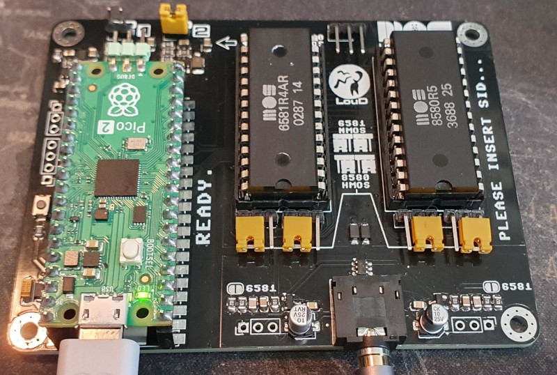
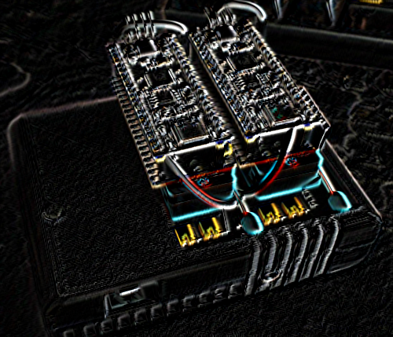
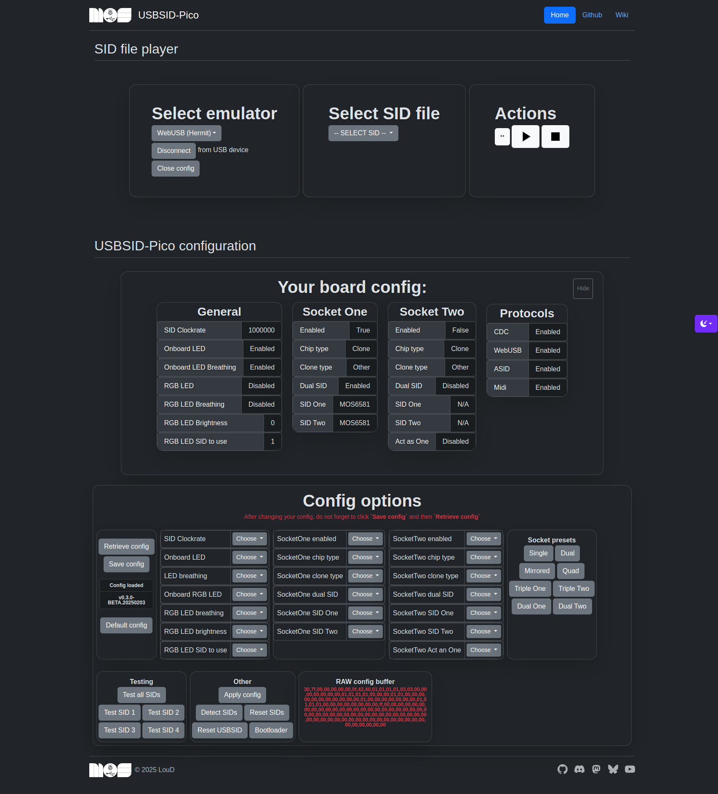
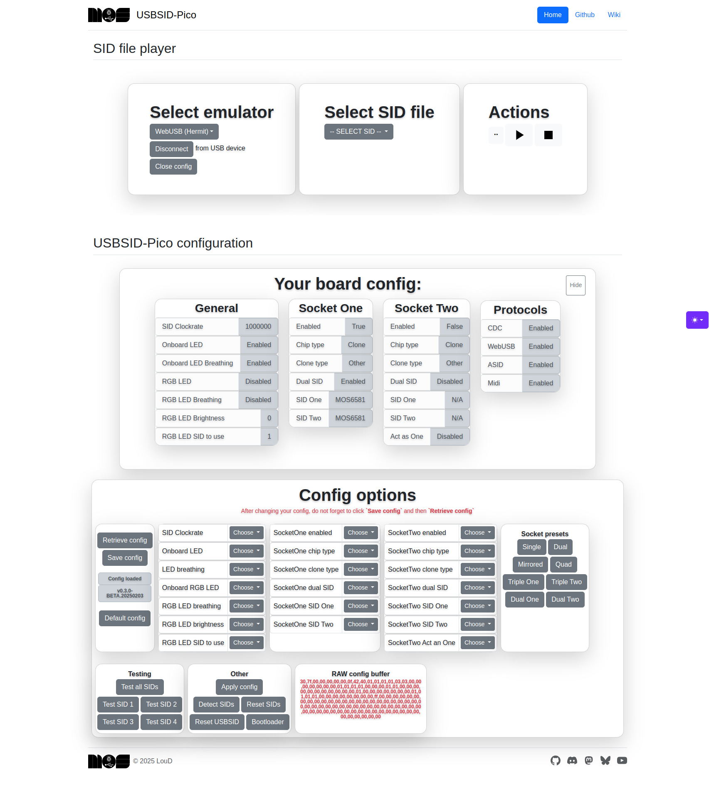
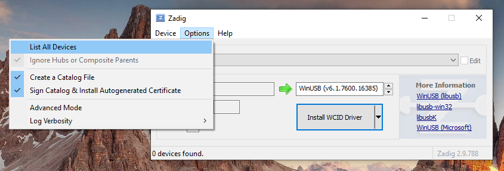
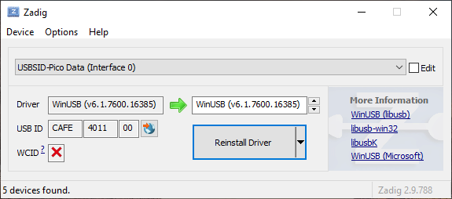
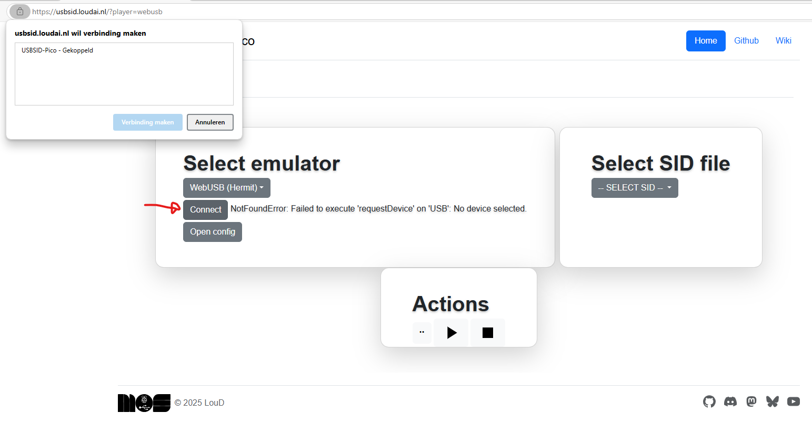
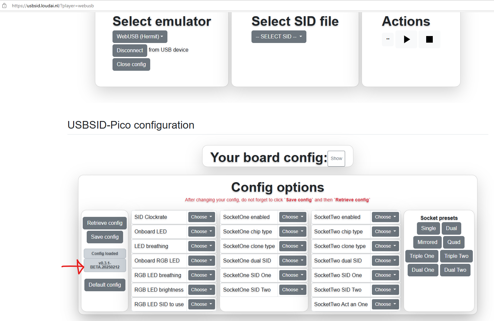
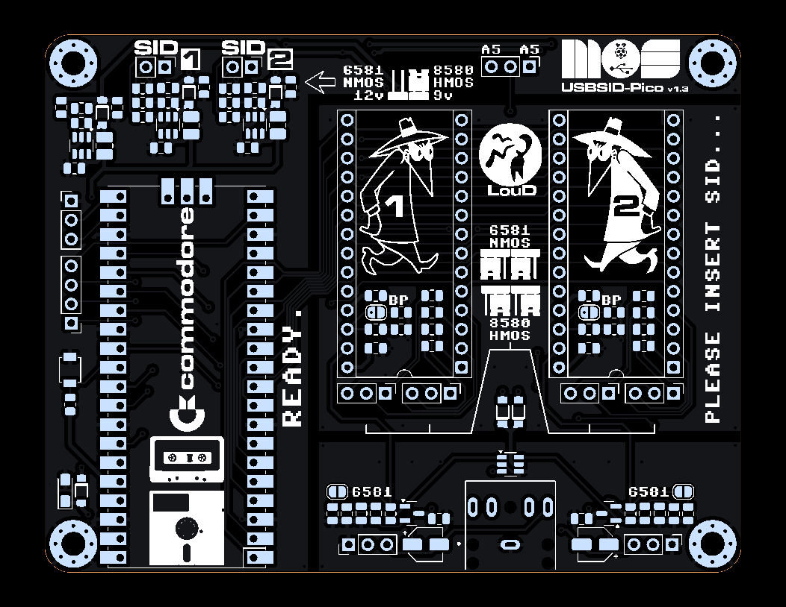
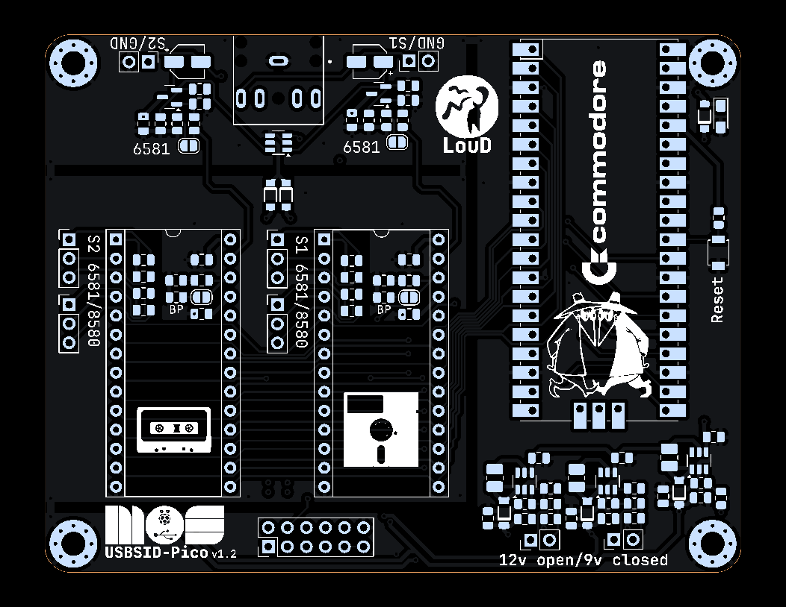

<br>

# USBSID-Pico
USBSID-Pico is a RaspberryPi Pico/PicoW (RP2040) & Pico2/Pico2W (RP2350) based board for interfacing one or two MOS SID chips and/or hardware SID emulators over (WEB)USB with your computer, phone, ASID supporting player or USB midi controller.  

* [Features](#features)
* [Questions & Support](#questions-and-support)
* [Project status](#project-status)
* [Firmware](#firmware)
  * [Firmware types and naming](doc/USBSID-Pico-firmware-manual.adoc) [(PDF)](doc/USBSID-Pico-firmware-manual.pdf)
  * [How to flash new firmware](doc/USBSID-Pico-firmware-manual.adoc) [(PDF)](doc/USBSID-Pico-firmware-manual.pdf)
  * [How to configure your board](doc/USBSID-Pico-firmware-manual.adoc) [(PDF)](doc/USBSID-Pico-firmware-manual.pdf)
  * [Known issues](#known-issues)
* [Hardware](#hardware)
  * [PCB usage information](#pcb-usage-information)
    * [PCB revision v1.0 manual](#pcb-revision-v10-manual)
    * [PCB revision v1.3 manual](#pcb-revision-v13-manual)
  * [Where to buy](#where-to-buy)
  * [Cases](#cases)
  * [Schematic and BOM](#schematic-and-bom)
  * [PCB Features](#pcb-features)
  * [PCB Development](#pcb-development)
* [Software](#software)
  * [Software manual](doc/USBSID-Pico-software-manual.adoc) [PDF](doc/USBSID-Pico-software-manual.pdf)
  * [Pre compiled Vice binaries](#precompiled-vice-binaries)
* [PCB in action](#usbsid-pico-in-action)
* [Acknowledgements](#acknowledgements)
* [Disclaimer](#disclaimer)
* [License](#license)
* [Changelog](CHANGELOG.md)

# Features
  
See the [Software manual](doc/USBSID-Pico-software-manual.adoc) for more information on how to use supported software!  
#### SID Playing
USBSID-Pico supports various ways of playing SID files.  
Out-of-the box playing is supported by using [Deepsid by Chordian](https://deepsid.chordian.net)  
by selecting `WebUSB (Hermit)` as player in the pulldown menu or  
by selecting `ASID (MIDI)` as player in the pulldown menu.  
Out-of-the box playing is also supported by using [C64jukebox by Kenchis](https://haendel.ddns.net:8443/static/c64jukebox.vue), note that this is still in BETA.  
[SidBerry](https://github.com/LouDnl/SidBerry) is a command line SID file player for Linux & Windows with up to 4 SIDs supported (Windows version is buggy).  
Unofficial support is added to a fork of [Vice](https://github.com/LouDnl/Vice-USBSID), up to 3 SIDs are supported in vsid and up to 4 in x64sc.  
Unofficial support is added to a fork of [sidplayfp](https://github.com/LouDnl/sidplayfp-usbsid) which requires a fork of [libsidplayfp](https://github.com/LouDnl/libsidplayfp-usbsid).  
Unofficial support is added to a fork of [RetroDebugger](https://github.com/LouDnl/RetroDebugger), up to 4 SIDs are supported.
##### Amiga
[erique](https://github.com/erique) and [koobo](https://github.com/koobo) have added support to [playsid](https://github.com/erique/playsid.library)
##### C64 Music trackers
You should be able to use the ASID fork of [sidfactory2](https://github.com/Chordian/sidfactory2/tree/asid-support) without issues.  
When using Vice or RetroDebugger you can freely use applications like [SID-Wizard](https://sourceforge.net/projects/sid-wizard/) for music creation.
#### Midi
USBSID-Pico acts as Midi device and supports basic Midi in ~ note that Midi is still in development and in Beta phase.  
This means that no support is available here at this time, please visit the Discord for more information.

# Questions and Support
Any questions about or support with USBSID-Pico can be asked 
* [Discord](https://discord.gg/zG2rxXuT2g)
* [Github discussions](https://github.com/LouDnl/USBSID-Pico/discussions)
* [USBSID manuals](doc/)

# Project status
Visit the [Project Page](https://github.com/users/LouDnl/projects/1) for an up-to-date list of things being worked on.
Firmware is in beta stage and still in development.  
While in development any mentioned features, options, etc. are subject to change.  
### Code status
|          | Master             | Dev                    |
| -------  | :-----             | :-----                 |
| Release  | [![release][1]][A] | [![tag][2]][B]       |
| Build    | [![build][3]][C]   | [![build][4]][C]       |
| Commit   | [![commit][5]][D]  | [![commit][6]][E]      |
|          | **Other**          |
| Latest   | [![tag][7]][F]     | [![release][8]][G]     |
| Open     | [![issues][9]][H]  | [![discussions][10]][I] |
| Info     | [![license][11]][J] | [![language][12]][K]   |

[1]: https://img.shields.io/github/v/release/LouDnl/USBSID-Pico
[2]: https://img.shields.io/github/v/tag/LouDnl/USBSID-Pico
[3]: https://img.shields.io/github/actions/workflow/status/LouDnl/USBSID-Pico/build.yml?branch=master
[4]: https://img.shields.io/github/actions/workflow/status/LouDnl/USBSID-Pico/build.yml?branch=dev
[5]: https://shields.io/github/last-commit/LouDnl/USBSID-Pico/master
[6]: https://shields.io/github/last-commit/LouDnl/USBSID-Pico/dev
[7]: https://shields.io/github/v/tag/LouDnl/USBSID-Pico?sort=semver
[8]: https://shields.io/github/v/release/LouDnl/USBSID-Pico
[9]: https://shields.io/github/issues/LouDnl/USBSID-Pico
[10]: https://shields.io/github/discussions/LouDnl/USBSID-Pico
[11]: https://shields.io/github/license/LouDnl/USBSID-Pico
[12]: https://shields.io/github/languages/top/LouDnl/USBSID-Pico
[A]: https://github.com/LouDnl/USBSID-Pico/actions/workflows/release.yml
[B]: https://github.com/LouDnl/USBSID-Pico/actions/workflows/tagged_build.yml
[C]: https://github.com/LouDnl/USBSID-Pico/actions/workflows/build.yml
[D]: https://github.com/LouDnl/USBSID-Pico/commits/master/
[E]: https://github.com/LouDnl/USBSID-Pico/commits/dev/
[F]: https://github.com/LouDnl/USBSID-Pico/tags
[G]: https://github.com/LouDnl/USBSID-Pico/releases
[H]: https://github.com/LouDnl/USBSID-Pico/issues
[I]: https://github.com/LouDnl/USBSID-Pico/discussions
[J]: https://github.com/LouDnl/USBSID-Pico/blob/master/LICENSE
[K]: https://github.com/LouDnl/USBSID-Pico

### Test and config your board
Also see the [Firmware manual](doc/USBSID-Pico-firmware-manual.adoc) for information on how to set up your board!  
You can configurate your board by using the commandline [config-tool](examples/config-tool) [binary](examples/config-tool/cfg_usbsid) (Linux only at the moment) provided in examples or use the web configurations, see below.  

You can test your board with WebUSB and ASID here: [USBSID](https://usbsid.loudai.nl/?player=webusb).  
If needed you can change your USBSID configuration after selecting WebUSB and clicking on `Open config`.  
<br>
_The player is set up with some borrowed code from Deepsid using Hermit's JsSID implementation._

#### Debug functions
For testing purposes only you can use the debug functions available on the [USBSID Debug](https://usbsid.loudai.nl/?player=webusb&debug=usbsidpico) site.

### Supported platforms
_In development_  
Linux: Vice, RetroDebugger, SidBerry, SidplayFp, JSidplay2, USB Midi, ASID (in webbrowser) SID Play  
Windows: Vice, SidBerry, USB Midi, ASID (in webbrowser) SID Play  
Android: USB Midi, ASID (in webbrowser) SID Play
Amiga: PlaySID library

### Linux Udev rules
Also see the [Software manual](doc/USBSID-Pico-software-manual.adoc) for more information on how to use supported software!  
In the [examples/udev](repo/examples/udev-rules/69-usbsid-permissions.rules) directory you can find the udev rules that I use on Linux. This purely an example file that you can use and change to your own needs.  
Steps required for this to work
```shell
  # Check if you are in the plugdev group
  groups  # should show the plugdev group
  # Copy the udev ules file to the correct directory
  sudo cp 69-usbsid-permissions.rules /etc/udev/rules.d
  # Now reload the udev rules
  sudo udevadm control --reload-rules && sudo udevadm trigger
  # Not working? Try reloading the service
  sudo systemctl restart udev
```

### Windows driver
Also see the [Software manual](doc/USBSID-Pico-software-manual.adoc) for mroe information on how to use supported software!  
Use [Zadig](https://zadig.akeo.ie/) to install the correct driver for USBSID-Pico.  

  
Then configure check, configure and test your board on the [USBSID](https://usbsid.loudai.nl/?player=webusb) config tool website  

  

# Firmware
See the [firmware changelog](CHANGELOG.md) for more information on what's changed and previous releases.  
Also see the [Firmware manual](doc/USBSID-Pico-firmware-manual.adoc) for more information on how to set up your board!  
### Firmware features
The firmware is still in development so features might change, be added or removed.
- By default both sockets are enabled and the configuration is set to 2 SID's.
- Custom CDC protocol for playing SID files or usage with emulators
- WebUSB support using the same CDC protocol for WebUSB supporting players
  - Play SID files in your browser via [Deepsid](https://deepsid.chordian.net/) by Chordian
  - Play SID files in your browser via [C64jukebox](https://haendel.ddns.net:8443/static/c64jukebox.vue) by Kenchis
- Midi (in) ASID support (heavily inspired by multiple sources)
  - Play SID files in your (midi supporting) browser via [Deepsid](https://deepsid.chordian.net/) by Chordian
  - Play SID files in your (midi supporting) browser via [IneSID](https://inesid.fazibear.me/) by Fazibear
- Midi device support over USB
  - Use your USBSID-Pico as Synth with your Midi controller
- Two SID sockets with up to 4 SID's (e.g. SKPico) supported
  - Socket one address range $00 ~ $7F (default $00 ~ $1F) auto based on configuration settings
  - Socket two address range $00 ~ $7F (default $40 ~ $7F) auto based on configuration settings
  - Configurable via [config-tool](repo/examples/config-tool) for Linux (Windows still in development)
- Onboard LED acts as VU meter calculated by the voices of SID1 (Pico & Pico2 only)
- Onboard RGB LED acts as second VU meter calculated by the voices of SID1 (default)
  - Requires Black Pico clone board with RGB LED onboard!
  - SID voices to use for calculation can be changed in config
- Uses the [TinyUSB](https://github.com/hathach/tinyusb) stack
### Known issues
* Digiplay is better in Vice then SidplayFp at the moment.  
  While not yet at 100%, most tunes will play!  
  See the [discussion](https://github.com/LouDnl/USBSID-Pico/discussions/1) about this.
### Building
You can build the firmware using the Pico SDK 2.1.1 and the included TinyUSB. Be sure to clone the SDK with `--recurse-submodules`.  
After download run `cd pico-sdk/lib/tinyusb` and then `python3 tools/get_deps.py PICO_PLATFORM` where PICO_PLATFORM is either rp2040 or rp2350 depending on the board you are using.

# Hardware
## Where to buy
#### Licensed resellers
[Run Stop Re-Store](https://www.runstoprestore.nl) at [Retro8BITshop](https://www.retro8bitshop.com) is the first reseller to sell licensed USBSID-Pico boards.  
PCB revision v1.0 [product page](https://www.retro8bitshop.com/product/usbsid-pico-by-loud/)  
PCB revision v1.3 [product page](https://www.retro8bitshop.com/product/usbsid-pico-by-loud/) (to be updated)
#### PCBWay
At a minimum of 5 bare or assembled boards it is also possible to purchase PCB's at PCBWay  
No account yet at [PCBWay](https://pcbway.com/g/2458i7)? Please use [my referral link](https://pcbway.com/g/2458i7) to register, thanks!  
[PCB revision v1.0](https://www.pcbway.com/project/shareproject/USBSID_Pico_c99c9748.html)  
[PCB revision v1.3](https://www.pcbway.com/project/shareproject/USBSID_Pico_v1_3_05f2b88e.html)
#### Me (when I have boards)
If available you can purchase (semi) assembled boards minus Pico from me - send me a message on any of my socials.  

## PCB usage information
Your USBSID-Pico PCB has several hardware features like jumpers and pins that require your attention. Click on the viewing method
### PCB revision v1.0 manual
- [Open online PCB v1.0 manual](doc/USBSID-Pico-PCBv1.0-manual.adoc)
- [Download PCB v1.0 PDF manual](doc/USBSID-Pico-PCBv1.0-manual.pdf)
### PCB revision v1.3 manual
- [Open online PCB v1.3 manual](doc/USBSID-Pico-PCBv1.3-manual.adoc)
- [Download PCB v1.3 PDF manual](doc/USBSID-Pico-PCBv1.3-manual.pdf)

## Cases
All USBSID-Pico community created cases are available in the [cases](cases/) directory, direct links below.  
_Cases for PCB revision v1.0:_
* [Cartridge case](cases/v1.0/spotUP) by @spotUP
* [boxy case](cases/v1.0/schorsch3000) by @schorsch3000

_Cases for PCB revision v1.3:_
* [spotUP Cartridge case revisited](cases/v1.3/spotUP-revisited) by @LouD

### Schematic and BOM
If you want and are up to it you can solder your own PCB or create your own development board using the documents below
#### revision v1.3
[v1.3 schematic](resources/v1.3-schematic.pdf) and [v1.3 interactive BOM](https://htmlpreview.github.io/?https://github.com/LouDnl/USBSID-Pico/blob/master/resources/v1.3-ibom.html)
#### revision v1.0
[v1.0 schematic](resources/v1.0-schematic.pdf) and [v1.0 interactive BOM](https://htmlpreview.github.io/?https://github.com/LouDnl/USBSID-Pico/blob/master/resources/v1.0-ibom.html)

### PCB Features
#### revision v1.3
- Supports all MOS SID chips e.g. MOS6581, MOS6582 & MOS8580
- Supports SID chip replacements e.g. [SIDKick-Pico](https://github.com/frntc/SIDKick-pico), [ARMSID](https://www.nobomi.cz/8bit/armsid/index_en.php) & [FPGASID](https://www.fpgasid.de), [SwinSID](https://github.com/dmantione/swinsid).
- USBSID-Pico will by default generate a 1 MHz square wave using pio
  - other clock speeds are configurable
- IO controlled Stereo/Mono switch, can be set in config or toggled during play with supported players
  - SID1 audio left
  - SID2 audio right
- Powered via USB
  - Three separate voltage regulators for filtered voltages to the SIDS
  - 1x fixed 5 volts and 2x 9 volts or 12 volts
  - 5v stepup for clean 5v VCC to both SID chips
  - Supports mixed voltage! e.g. you can use one MOS6581 (12v) together with one MOS6582 (9v) or MOS8580 (9v)
  - 12v/9v jumper for each SID socket, defautls to 12v ~ inspired by SIDBlaster-Nano design
- Audio out filter as in the C64 schematics
  - With optional 6581 resistor, solder the 6581 jumper pad in each audio circuit for this.
- Optional EXT-IN pulldown resistor as filter bypass to reduce filter noise for Digiplay on 8580 SID's
- SID socket placement is more spread out for:
  - easier filter capacitor access
  - optional ZIF sockets
- Better IO port layout
  - Unused GPIO pins for optional future expansion boards
  - IO5 pins for quad SID configuration
  - Uart pins
  - SID Ext in pins (requires closing the solder jumper on the bottom)
  - Ground pin
- New soldermask art ;)
### revision v1.0
- Supports all MOS SID chips e.g. MOS6581, MOS6582 & MOS8580
- Supports SID chip replacements e.g. [SIDKick-Pico](https://github.com/frntc/SIDKick-pico), [SwinSID](https://github.com/dmantione/swinsid), ARMSID (untested), FPGASID (untested)
- 1 MHz oscillator (external optional, enabled via jumper pad)
  - if no external clock is detected USBSID-Pico will generate a 1 MHz square wave using pio
    - clock speed is configurable
  - if an external clock is detected will read the external clock signal
- Power via USB
  - 5v stepup for clean 5v VCC to both SID chips
  - 12v or 9v stepup for clean VDD to both SID chips
    - 12v/9v jumper, defautls to 12v ~ inspired by [SIDBlaster-Nano](https://codeberg.org/CBMretro/SIDBlaster-USB_Nano) design
- Audio out filter as in the [C64 schematics](https://www.zimmers.net/anonftp/pub/cbm/schematics/computers/c64/250469-rev.A-right.gif)
  - With optional 6581 resistor, solder the 6581 (mislabeled 8580!) jumper pad in each audio circuit for this.
- Audio jumper
  - SID1 audio left & right
  - SID1 audio left & SID2 audio right
- Optional EXT-IN pulldown resistor as filter bypass to reduce filter noise for Digiplay on 8580 SID's
### PCB Development
* v1.3b release board<br>
  [](images/v1.3b-top.png) 
* v1.2 testboard<br>
  [](images/v1.2-top.png) 
* v1.1 unfinished and skipped
* v1.0 release board<br>
  [](images/v1.0-top.png) 
* v0.2 improved testboard<br>
  [](images/v0.2-top.png) 
* v0.1 testboard<br>
  [](images/v0.1-top.png) 

# Examples
### USBSID-Pico in action
Videos and/or audio links are subject to be changed or updated at any time.
| **Van Halen's Jump<br>in Stereo!** | **Flamethrower** |
|:-:|:-:|
| [](https://www.youtube.com/watch?v=lzvkWlDq2TM)<br><small><sub>by Nordischsound</sub></small> | [](https://www.youtube.com/watch?v=Mfbj21ntQXA)<br><small><sub>by Reed</sub></small> |

Visit my [Youtube channel](https://www.youtube.com/channel/UCOu1hPBTsEbG7ZFnk9-29KQ), [other socials](https://github.com/LouDnl) or the [SHOWCASE](SHOWCASE.md) page to see more examples.
### Software
Also see the [Software manual](doc/USBSID-Pico-software-manual.adoc) for information on how to use supported software!  
_Available examples with USBSID-Pico support:_<br>
[**USBSID-Pico driver**](https://github.com/LouDnl/USBSID-Pico-driver) repo is available @ https://github.com/LouDnl/USBSID-Pico-driver<br>
[**HardSID USB / SidBlaster USB**](examples/hardsid-sidblaster) emulation driver example<br>
[**Vice**](https://github.com/LouDnl/Vice-USBSID) fork is available @ https://github.com/LouDnl/Vice-USBSID<br>
[**sidplayfp**](https://github.com/LouDnl/sidplayfp-usbsid) for [**libsidplayfp**](https://github.com/LouDnl/libsidplayfp-usbsid) forks are available @ https://github.com/LouDnl/sidplayfp-usbsid and https://github.com/LouDnl/libsidplayfp-usbsid<br>
[**SidBerry**](https://github.com/LouDnl/SidBerry) fork is available @ https://github.com/LouDnl/SidBerry<br>
[**RetroDebugger**](https://github.com/LouDnl/RetroDebugger) fork is available @ https://github.com/LouDnl/RetroDebugger<br>
[**playsid.library**](https://github.com/erique/playsid.library) Amiga implementation is available @ https://github.com/erique/playsid.library<br>
### Precompiled Vice binaries
Pre compiled Vice binaries are available in my fork @ https://github.com/LouDnl/Vice-USBSID/releases

# Acknowledgements
Special thanks goes out to [Tobozo](https://github.com/tobozo/) for making the USBSID-Pico logo and for his (mental🤣) support since starting this project.  
Thanks to [erique](https://github.com/erique) and [koobo](https://github.com/koobo) for creating and implementing Amiga support!  
Thanks to [Chordian](https://github.com/Chordian) for implementing my crappy webusb solution into deepsid.  
Thanks to [Ken](https://sourceforge.net/u/kenchis/profile/) for adding webusb support to jsidplay2's c64jukebox.

Some portions of this code and board are heavily inspired on projects by other great people.
Some of those projects are - in no particular order:
* [SIDKICK-pico by Frenetic](https://github.com/frntc/SIDKick-pico)
* [SIDBlaster USB Nano by CBMretro](https://codeberg.org/CBMretro/SIDBlaster-USB_Nano)
* [TherapSID by Twisted Electrons](https://github.com/twistedelectrons/TherapSID)
* [TeensyROM by Sensorium Embedded](https://github.com/SensoriumEmbedded/TeensyROM)
* [SID Factory II by Chordian](https://github.com/Chordian/sidfactory2)
* [Cynthcart by PaulSlocum](https://github.com/PaulSlocum/cynthcart)

# Disclaimer
I do this stuff in my free time for my enjoyment. Since I like to share my joy in creating this with everyone I try my best to provide a working PCB and Firmware. I am in no way an electronics engineer and can give __no guarantees__ that this stuff does not break or damage your hardware, computer, phone, or whatever you try to hook it up to. Be sure to take great care when inserting any real MOS SID chips into the board. While everything has been tested with real chips, this is in no way a guarantee that nothing could go wrong. Use of this board and firmware at your own risk! I am in no way responsible for your damaged hardware. That being said, have fun!

# License
### Software License ~ GNUv2
All code written by me in this repository is licensed under the terms of the GNU General Public License as published by the Free Software Foundation, version 2.
Any code in this repository that is not written by me automatically falls under the licensing conditions by the authors of said code as mentioned in the source code header.
For for more information about this license please read the LICENSE document in the root of the USBSID-Pico repository.
### Hardware License ~ Creative Commons
<p xmlns:cc="http://creativecommons.org/ns#" xmlns:dct="http://purl.org/dc/terms/"><a property="dct:title" rel="cc:attributionURL" href="https://github.com/LouDnl/USBSID-Pico">USBSID-Pico PCB</a> by <a rel="cc:attributionURL dct:creator" property="cc:attributionName" href="https://github.com/LouDnl">LouD</a> is licensed under <a href="https://creativecommons.org/licenses/by-nc-nd/4.0/?ref=chooser-v1" target="_blank" rel="license noopener noreferrer" style="display:inline-block;">Creative Commons Attribution-NonCommercial-NoDerivatives 4.0 International</a></p>
