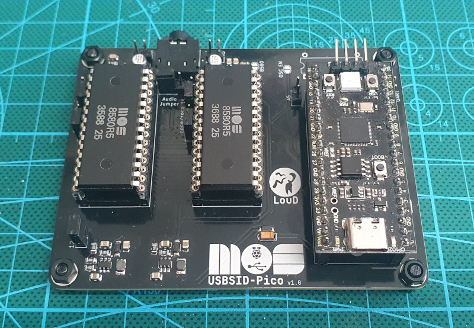 

# USBSID-Pico
USBSID-Pico is a RPi Pico/PicoW (RP2040) & Pico2 (RP2350) based board for interfacing one or two MOS SID chips and/or hardware SID emulators over (WEB)USB with your computer, phone, ASID supporting player or USB midi controller.  

* [Features](#features)
* [Questions & Support](#questions-and-support)
* [Project status](#project-status)
* [Firmware](#firmware)
  * [Firmware versions](#firmware-versions)
  * [How to flash new firmware](#how-to-flash)
* [Hardware](#hardware)
  * [Where to buy](#where-to-buy)
  * [Schematic and BOM](#schematic-and-bom)
  * [Cases](#cases)
* [Important PCB information](#important-pcb-information)
* [PCB in action](#usbsid-pico-in-action)
* [Software examples](#software)
  * [Pre compiled Vice binaries](#precompiled-vice-binaries)
* [Acknowledgements](#acknowledgements)
* [Disclaimer](#disclaimer)
* [License](#license)
* [Changelog](CHANGELOG.md)

# Features
Information about and explanation of features are _Coming Soon™_  
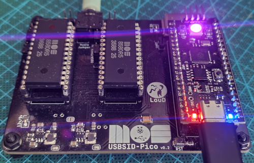
#### SID Playing
USBSID-Pico supports various ways of playing SID files.  
Out-of-the box playing is supported by using [Deepsid by Chordian](https://deepsid.chordian.net)  
by selecting `WebUSB (Hermit)` as player in the pulldown menu or  
by selecting `ASID (MIDI)` as player in the pulldown menu.  
[SidBerry](https://github.com/LouDnl/SidBerry) is a command line SID file player for Linux with up to 4 SIDs supported.  
Unofficial support is added to a fork of [Vice](https://github.com/LouDnl/Vice-USBSID), up to 3 SIDs are supported in vsid and up to 4 in xs64.  
Unofficial support is added to a fork of [RetroDebugger](https://github.com/LouDnl/RetroDebugger), up to 4 SIDs are supported.
##### C64 Music trackers
When using Vice or RetroDebugger you can freely use applications like [SID-Wizard](https://sourceforge.net/projects/sid-wizard/) for music creation.
#### Midi
USBSID-Pico acts as Midi device and supports basic Midi in ~ note that Midi is still in development and in Beta phase.  
This means that no support is available here at this time, please visit the Discord for more information.

# Questions and Support
Any questions about or support with USBSID-Pico can be asked 
* on [Discord](https://discord.gg/zG2rxXuT2g)
* or in the [discussions](https://github.com/LouDnl/USBSID-Pico/discussions).

# Project status
Visit the [Project Page](https://github.com/users/LouDnl/projects/1) for an up-to-date list of things being worked on.
Firmware is in beta stage and still in development.  
While in development any mentioned features, options, etc. are subject to change.  
### Code status
|          | Master             | Dev                    |
| -------  | :-----             | :-----                 |
| Build    | [![release][1]][A] | [![build][2]][B]       |
| Commit   | [![commit][3]][C]  | [![commit][4]][D]      |
|          | **Other**          |
| Latest   | [![tag][5]][E]     | [![release][6]][F]     |
| Open     | [![issues][7]][G]  | [![discussions][8]][H] |
| Info     | [![license][9]][I] | [![language][10]][J]   |

[1]: https://github.com/LouDnl/USBSID-Pico/actions/workflows/release.yml/badge.svg?branch=master
[2]: https://github.com/LouDnl/USBSID-Pico/actions/workflows/build.yml/badge.svg?branch=dev
[3]: https://shields.io/github/last-commit/LouDnl/USBSID-Pico/master
[4]: https://shields.io/github/last-commit/LouDnl/USBSID-Pico/dev
[5]: https://shields.io/github/v/tag/LouDnl/USBSID-Pico?sort=semver
[6]: https://shields.io/github/v/release/LouDnl/USBSID-Pico
[7]: https://shields.io/github/issues/LouDnl/USBSID-Pico
[8]: https://shields.io/github/discussions/LouDnl/USBSID-Pico
[9]: https://shields.io/github/license/LouDnl/USBSID-Pico
[10]: https://shields.io/github/languages/top/LouDnl/USBSID-Pico
[A]: https://github.com/LouDnl/USBSID-Pico/actions/workflows/release.yml
[B]: https://github.com/LouDnl/USBSID-Pico/actions/workflows/build.yml
[C]: https://github.com/LouDnl/USBSID-Pico/commits/master/
[D]: https://github.com/LouDnl/USBSID-Pico/commits/dev/
[E]: https://github.com/LouDnl/USBSID-Pico/tags
[F]: https://github.com/LouDnl/USBSID-Pico/releases
[G]: https://github.com/LouDnl/USBSID-Pico/issues
[H]: https://github.com/LouDnl/USBSID-Pico/discussions
[I]: https://github.com/LouDnl/USBSID-Pico/blob/master/LICENSE
[J]: https://github.com/LouDnl/USBSID-Pico
### Test and config your board
I have set up a small test player using Hermit's JsSID implementation (borrowed from Deepsid).  
You can test (and config) your board with WebUSB and ASID here: [USBSID](https://usbsid.loudai.nl/index.html?player=webusb).  
If needed you can change your SID count configuration after selecting WebUSB.
#### Debug functions
For testing purposes only you can use the debug functions available on the [USBSID Debug](https://usbsid.loudai.nl/index.html?player=webusb&debug=usbsidpico) site.
### Supported platforms
_In development_  
Linux: Vice, RetroDebugger, SidBerry, JSidplay2, USB Midi, ASID (in webbrowser) SID Play  
Windows: Vice  
Windows/Android: USB Midi, ASID (in webbrowser) SID Play

# Firmware
See the [firmware changelog](CHANGELOG.md) for more information on what's changed and previous releases.
### Firmware versions
Use `usbsidpico.uf2` for Pico1 regular green rp2040 Pico boards.  
Use `usbsidpico-rgb.uf2` for Pico1 black clone rp2040 Pico boards with RGB LED onboard.  
Use `usbsidpico_w.uf2` for PicoW regular green rp2040 PicoW boards.  
Use `usbsidpico2.uf2` for Pico2 regular green rp2350 Pico2 boards.  
**WARNING!** Do _NOT_ use the RGB firmware for any of the (non black) rp2040 or rp2350 Pico boards that do not contain an RGB LED.
### How to flash
A Raspberry Pi Pico board is incredibly easy to flash, as it comes with a built in bootloader for flashing new firmwares in the `uf2` format. 
In order to flash a new firmware to your USBSID-Pico you will need to put the Pico into bootloader mode. This can be done in 2 ways:
1. While the Pico is seated on the USBSID-Pico board and with the USB cable plugged into your computer and the Pico do the following:
	- Press and hold the `BOOTSEL` button on the Pico.
	- Press and release the `RST` button on the USBSID-Pico board.
	- Now release the `BOOTSEL` button.
	- A new drive should appear on your computer called `RPI-RP2`.
	- Copy the correct `uf2` firmware file to this folder.
	- After copying the Pico will reboot and your Pico is flashed.
2. When flashing a Pico that is not seated on the board do the following:
	- Plug in the USB cable to your Pico and not into your computer.
	- While holding the `BOOTSEL` button on the Pico plugin the other end of the USB cable into your computer.
	- Now release the `BOOTSEL` button.
	- A new drive should appear on your computer called `RPI-RP2`.
	- Copy the correct `uf2` firmware file to this folder.
	- After copying the Pico will reboot and your Pico is flashed.
### Firmware features
The firmware is still in development so features might change, be added or removed.
- By default both sockets are enabled and the configuration is set to 2 SID's.
- Custom CDC protocol for playing SID files or usage with emulators
- WebUSB support using the same CDC protocol for WebUSB supporting players
- Midi (in) ASID support (heavily inspired by multiple sources)
  - Play SID files in your (midi supporting) browser via [Deepsid](https://deepsid.chordian.net/) by Chordian
  - Play SID files in your (midi supporting) browser via [IneSID](https://inesid.fazibear.me/) by Fazibear
- Midi device support over USB
  - Use your USBSID-Pico as Synth with your Midi controller
- Two SID sockets with up to 4 SID's (e.g. SKPico) supported
  - Socket one address range $00 ~ $3F (default $00 ~ $1F)
  - Socket two address range $20 ~ $7F (default $20 ~ $3F)
  - Configurable (platform independent (Linux/Windows) tool still in development)
- Onboard LED acts as VU meter calculated by the voices of SID1 (Pico & Pico2 only)
- Onboard RGB LED acts as second VU meter calculated by the voices of SID1 (default)
  - Requires Black Pico clone board with RGB LED onboard!
  - SID voices to use for calculation can be changed in config
- Uses the [TinyUSB](https://github.com/hathach/tinyusb) stack
### ISSUES that need addressing (Any help is welcome)
* Digiplay does not work like it should. This is a driver issue (client side).
  At one point I had this working with Async LIBUSB but forgot to backup it, DOH!  
  See the [discussion](https://github.com/LouDnl/USBSID-Pico/discussions/1) about this.
### Building
You can build the firmware using the Pico SDK 2.0.0 and TinyUSB from it's Github repo, not the one included in the SDK!

# Hardware
### Where to buy
#### Licensed resellers
[Run Stop Re-Store](https://www.runstoprestore.nl) at [Retro8BITshop](https://www.retro8bitshop.com) is the first reseller to sell licensed USBSID-Pico boards.  
Click [this link](https://www.retro8bitshop.com/product/usbsid-pico-by-loud/) to go to their product page
#### PCBWay
At a minimum of 5 bare or assembled boards it is also possible to purchase at [PCBWay here](https://www.pcbway.com/project/shareproject/USBSID_Pico_c99c9748.html).  
#### Me (while I still have boards)
While still available you can purchase assembled boards minus Pico from me - send me a message on any of my socials.  

### Schematic and BOM
If you want and are up to it you can create your own development board by using the provided [schematic](resources/v1.0-schematic.pdf) and [interactive BOM](https://loudnl.github.io/).
### PCB Features ~ v1.0
- Supports all MOS SID chips e.g. MOS6581, MOS6582 & MOS8580
- Supports SID chip replacements e.g. [SIDKick-Pico](https://github.com/frntc/SIDKick-pico), [SwinSID](https://github.com/dmantione/swinsid), ARMSID (untested), FPGASID (untested)
- 1 MHz oscillator (external optional, enabled via jumper pad)
  - if no external clock is detected USBSID-Pico will generate a 1 MHz square wave using pio
    - clock speed is configurable
  - if an external clock is detected will read the external clock signal
- Power via USB
  - 5v stepup for clean 5v VCC to both SID chips
  - 12v or 9v stepup for clean VDD to both SID chips
    - 12v/9v jumper, defautls to 12v ~ inspired by [SIDBlaster-Nano](https://codeberg.org/CBMretro/SIDBlaster-USB_Nano) design
- Audio out filter as in the [C64 schematics](https://www.zimmers.net/anonftp/pub/cbm/schematics/computers/c64/250469-rev.A-right.gif)
  - With optional 6581 resistor, solder the 6581 (mislabeled 8580!) jumper pad in each audio circuit for this.
- Audio jumper
  - SID1 audio left & right
  - SID1 audio left & SID2 audio right
- Optional EXT-IN pulldown resistor as filter bypass to reduce filter noise for Digiplay on 8580 SID's
### PCB Development
* v1.0 release board 
  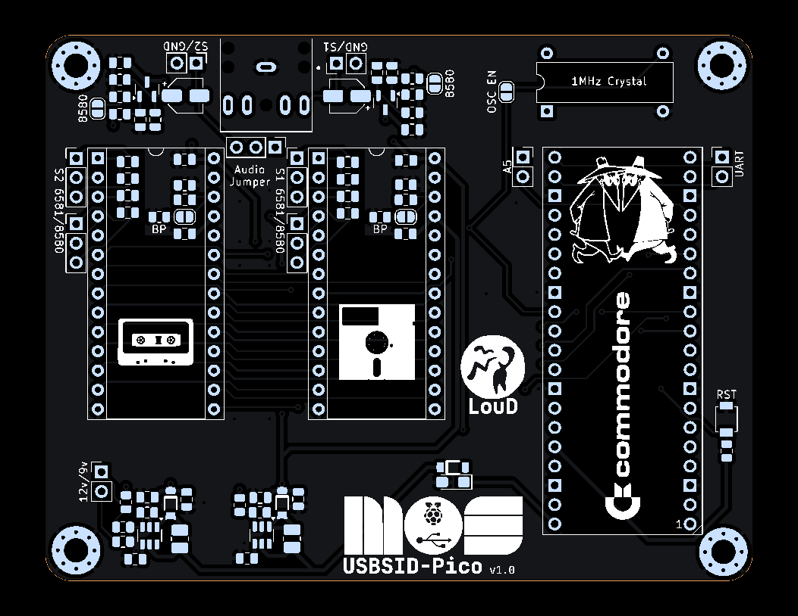
* v0.2 improved testboard 
  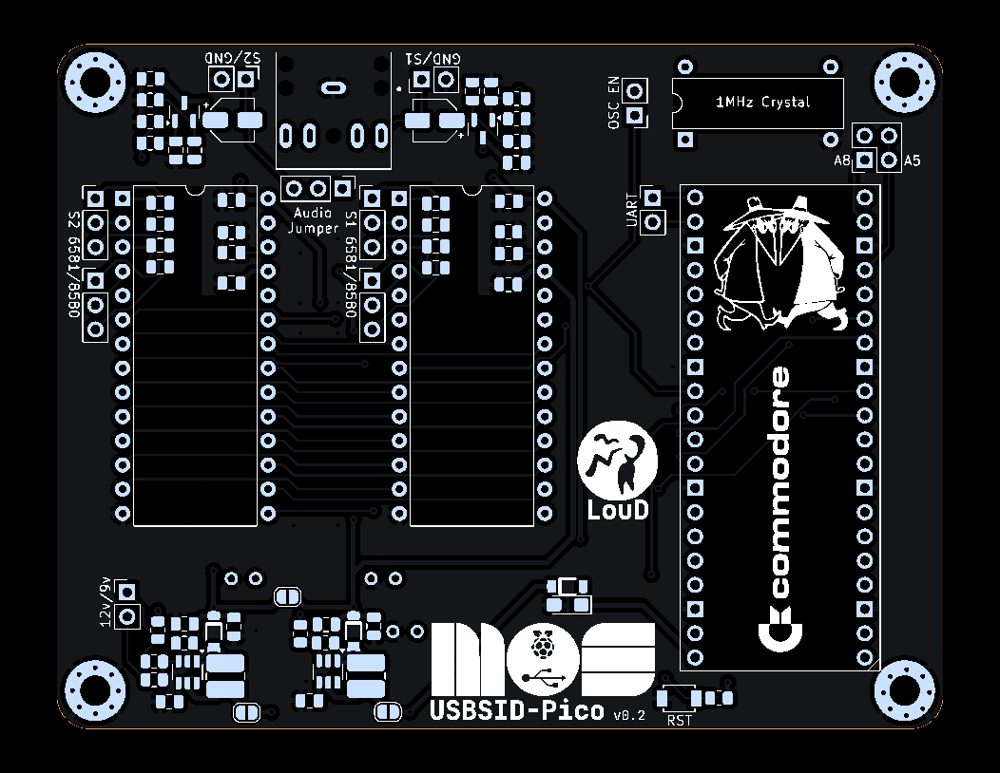
* v0.1 testboard 
  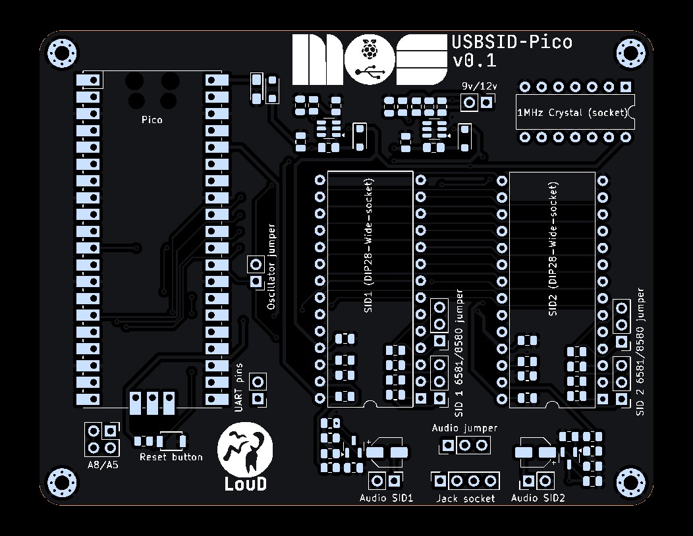  

## Cases
All USBSID-Pico community created cases are available in the [cases](cases/) folder, direct links below.
* [Cartridge case](cases/spotUP/USBSID-Pico_Case.zip) by @spotUP

## Important PCB information
[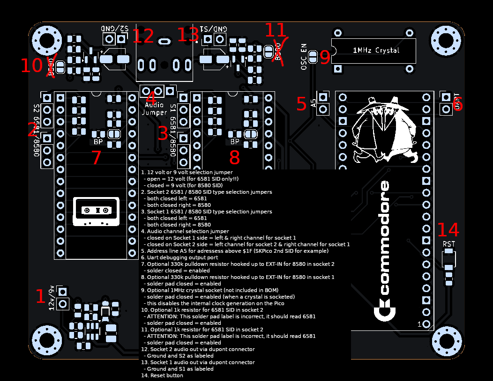](images/v1.0-explained.png) 
_Click image for larger view_
1. 12 volt or 9 volt selection jumper  
  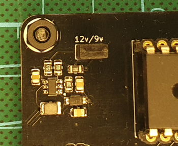
  - open = 12 volt (for 6581 SID only!!)
  - closed = 9 volt (for 8580 SID)
2. Socket 2 6581 / 8580 SID type selection jumpers  
  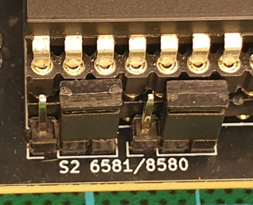
  - both closed left = 6581
  - both closed right = 8580
3. Socket 1 6581 / 8580 SID type selection jumpers  
  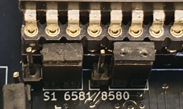
  - both closed left = 6581
  - both closed right = 8580
4. Audio channel selection jumper  
  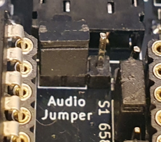
  - closed on Socket 1 side = left & right channel for socket 1
  - closed on Socket 2 side = left channel for socket 2 & right channel for socket 1
5. Address line A5 for adressess above $1F (SKPico 2nd SID for example)  
  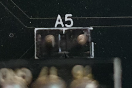
  - both pins are routed to the same GPIO for using adresses higher then $20
6. Uart debugging output port  
  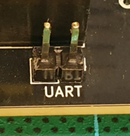
  - TX on the right
  - RX on the left
7. Optional 330k pulldown resistor hooked up to EXT-IN for 8580 filter bypass in socket 2  
    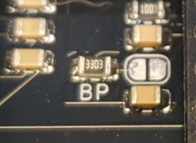
  - solder closed = enabled
8. Optional 330k pulldown resistor hooked up to EXT-IN for 8580 filter bypass in socket 1  
  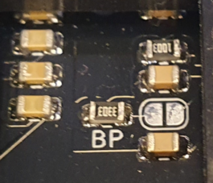
  - solder pad closed = enabled
9. Optional 1MHz crystal socket (not included in BOM)  
  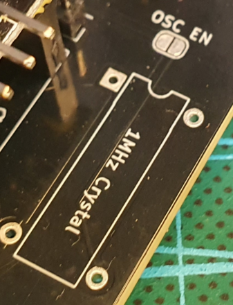
  - solder pad closed = enabled (when a crystal is socketed) 
  - this disables the internal clock generation on the Pico
10. Optional 1k resistor for 6581 SID in socket 2
  - **ATTENTION!**: _This solder pad label is incorrect, it should read 6581!_  
  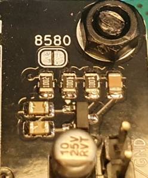
  - solder pad closed = enabled
11. Optional 1k resistor for 6581 SID in socket 2
  - **ATTENTION!**: _This solder pad label is incorrect, it should read 6581!_  
  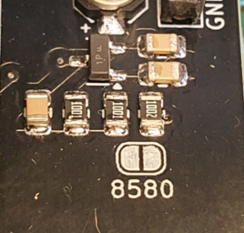
  - solder pad closed = enabled
12. Socket 2 audio out via dupont connector  
  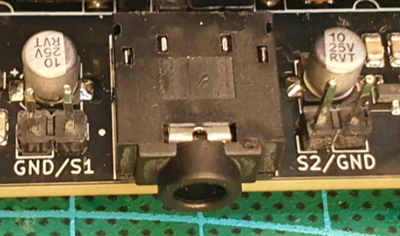
  - Ground and S2 as labeled
13. Socket 1 audio out via dupont connector  
  
  - Ground and S1 as labeled
14. Reset button  
  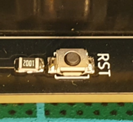

# Examples
### USBSID-Pico in action
While in development any videos and/or audio links are subject to be changed or updated.
#### MOS8580 chip
| **Layers Finnish Gold** | **Mojo Bonzai & Pretzel Logic** | **Spy vs Spy II The Island Caper** |
|:-:|:-:|:-:|
|  |  |  |

Visit my [Youtube channel](https://www.youtube.com/channel/UCOu1hPBTsEbG7ZFnk9-29KQ), [other socials](https://github.com/LouDnl) or the [SHOWCASE](SHOWCASE.md) page to see more examples.
### Software
_Available examples with USBSID-Pico support:_ 
[**HardSID USB / SidBlaster USB**](examples/hardsid-sidblaster) driver example 
[**Vice**](https://github.com/LouDnl/Vice-USBSID) fork is available @ https://github.com/LouDnl/Vice-USBSID 
[**SidBerry**](https://github.com/LouDnl/SidBerry) fork is available @ https://github.com/LouDnl/SidBerry 
[**RetroDebugger**](https://github.com/LouDnl/RetroDebugger) fork is available @ https://github.com/LouDnl/RetroDebugger 
### Precompiled Vice binaries
Pre compiled Vice binaries are available in my fork @ https://github.com/LouDnl/Vice-USBSID/tree/main/builds

# Acknowledgements
Special thanks goes out to [Tobozo](https://github.com/tobozo/) for making the USBSID-Pico logo and for his (mental🤣) support since starting this project.

Some portions of this code and board are heavily inspired on projects by other great people.
Some of those projects are - in no particular order:
* [SIDKICK-pico by Frenetic](https://github.com/frntc/SIDKick-pico)
* [SIDBlaster USB Nano by CBMretro](https://codeberg.org/CBMretro/SIDBlaster-USB_Nano)
* [TherapSID by Twisted Electrons](https://github.com/twistedelectrons/TherapSID)
* [TeensyROM by Sensorium Embedded](https://github.com/SensoriumEmbedded/TeensyROM)
* [SID Factory II by Chordian](https://github.com/Chordian/sidfactory2)
* [Cynthcart by PaulSlocum](https://github.com/PaulSlocum/cynthcart)

# Disclaimer
I do this stuff in my free time for my enjoyment. Since I like to share my joy in creating this with everyone I try my best to provide a working PCB and Firmware. I am in no way an electronics engineer and can give __no guarantee__ that this stuff does not break or damage your hardware, computer, phone, or whatever you try to hook it up to. Be sure to take great care when inserting any real MOS SID chips into the board. While everything has been tested with real chips, this is in no way a guarantee that nothing could go wrong. Use of this board and firmware at your own risk! I am in no way responsible for your damaged hardware. That being said, have fun!

# License
### Software License ~ GNUv2
All code written by me in this repository islicensed under the terms of the GNU General Public License as published by the Free Software Foundation, version 2.
Any code in this repository that is not written by me automatically falls under the licensing conditions by the authors of said code as mentioned in the source code header.
### Hardware License ~ Creative Commons

<a property="dct:title" rel="cc:attributionURL" href="https://github.com/LouDnl/USBSID-Pico">USBSID-Pico PCB</a> by <a rel="cc:attributionURL dct:creator" property="cc:attributionName" href="https://github.com/LouDnl">LouD</a> is licensed under <a href="https://creativecommons.org/licenses/by-nc-nd/4.0/?ref=chooser-v1" target="_blank" rel="license noopener noreferrer" style="display:inline-block;">Creative Commons Attribution-NonCommercial-NoDerivatives 4.0 International</a>

