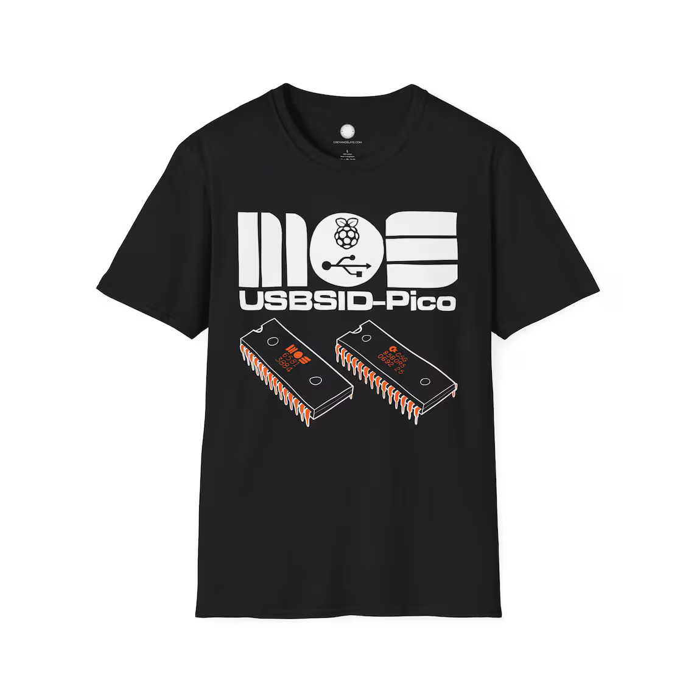
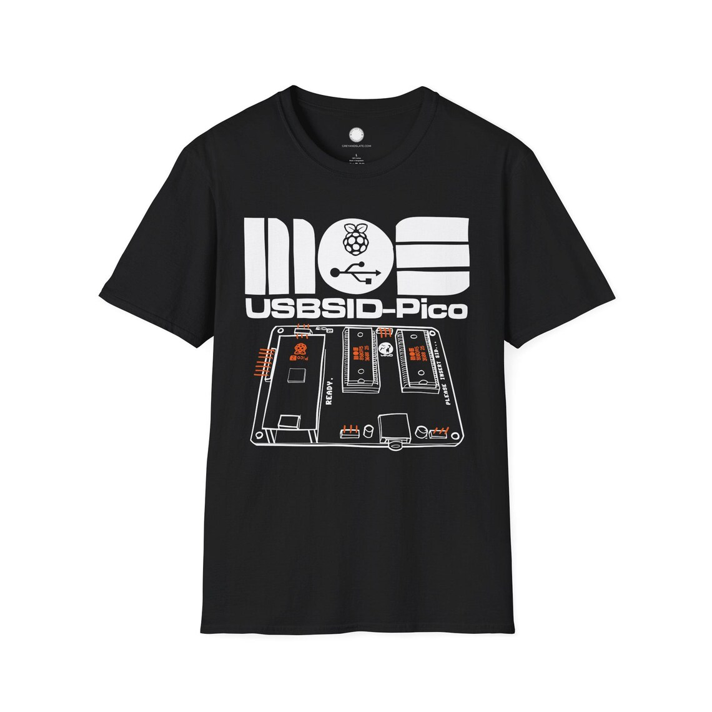
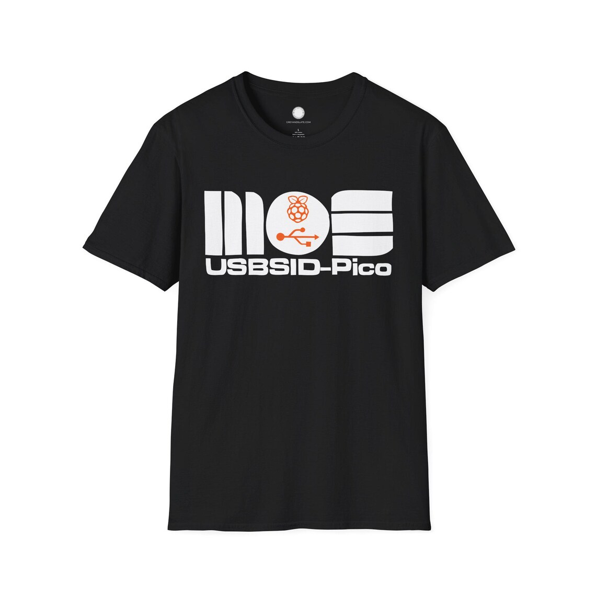
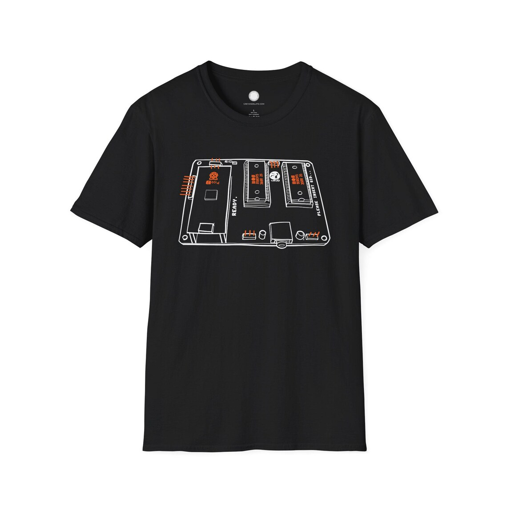
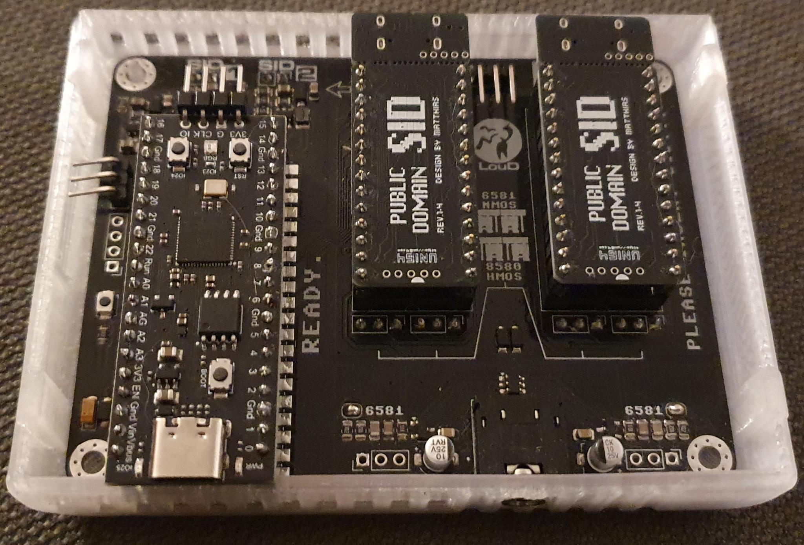
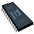
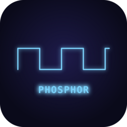
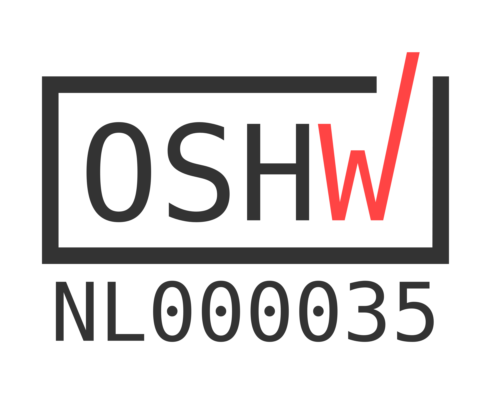

 
# 
USBSID-Pico is a RaspberryPi Pico/PicoW (RP2040) & Pico2/Pico2W (RP2350) based board for interfacing one or two MOS SID chips and/or hardware SID emulators over (WEB)USB with your computer, phone, ASID supporting player or USB midi controller.  

# This is USBSID-Pico! :)
| **“Raster Bar” (8-bit)** | **Van Halen's Jump dual SID in Stereo!** | **Next Level** | **Outerversal dual SID in Stereo!** |
|:-:|:-:|:-:|:-:|
|  <small>by LukHash</small> |  <small>by Nordischsound</small> |  <small>by Performers |  <small>by Abyxus</small> |

| **Wonderland XI** | **Wonderland XII** | **Wonderland XIII** | **Wonderland XIV** |
|:-:|:-:|:-:|:-:|
|  <small>by Censor Design</small> |  <small>by Censor Design</small> |  <small>by Censor Design |  <small>by Censor Design</small> |

# Swag!
Do you like swag!? I sure do!! [greyandslate](https://bsky.app/profile/greyandslate.bsky.social) created these great t-shirt designs which are available for purchase in his [Etsy shop](https://greyandslate.etsy.com/?search_query=usbsid), link below.  
**Use coupon code USBSID15 for a 15% discount!**  
Shop link: [https://greyandslate.etsy.com/?search_query=usbsid](https://greyandslate.etsy.com/?search_query=usbsid)  

 

# Index
* [Software support & Features](#software-support-and-features)
  * [Software manual](doc/USBSID-Pico-software-manual.adoc) [PDF](doc/USBSID-Pico-software-manual.pdf)
  * [SID Playing](#sid-playing)
  * [C64 emulators](#c64-emulators)
  * [C64 Music trackers](#c64-music-trackers)
  * [Amiga](#amiga)
  * [Driver code](#driver-code)
  * [Midi](#midi)
* [Questions & Support](#questions-and-support)
* [Project status](#project-status)
  * [Known issues](#known-issues)
  * [Code status](#code-status)
  * [Supported platforms](#supported-platforms)
  * [Linux Udev rules](#linux-udev-rules)
  * [Windows driver](#windows-driver)
* [Firmware](#firmware)
  * [Configuring your board's firmware](#configuring-your-boards-firmware)
    * [Testing your board](#testing-your-board)
  * [Firmware features](#firmware-features)
    * [Embedded Cynthcart](doc/USBSID-Pico-Cynthcart-manual.adoc) [(PDF)](doc/USBSID-Pico-Cynthcart-manual.pdf)
    * [Embedded USBSID-Player](doc/USBSID-Player-manual.adoc) [(PDF)](doc/USBSID-Player-manual.pdf)
  * [Firmware types and naming](doc/USBSID-Pico-firmware-manual.adoc) [(PDF)](doc/USBSID-Pico-firmware-manual.pdf)
  * [How to flash new firmware](doc/USBSID-Pico-firmware-manual.adoc) [(PDF)](doc/USBSID-Pico-firmware-manual.pdf)
  * [How to configure your board](doc/USBSID-Pico-firmware-manual.adoc) [(PDF)](doc/USBSID-Pico-firmware-manual.pdf)
  * [Building](#building)
* [Hardware](#hardware)
  * [Where to buy](#where-to-buy)
  * [PCB usage information](#pcb-usage-information)
    * [PCB revision v1.0 manual](#pcb-revision-v10-manual)
    * [PCB revision v1.3 manual](#pcb-revision-v13-manual)
  * [Cases](#cases)
  * [PCB Features](#pcb-features)
  * [Open source design files, schematic and BOM](#open-source-design-files-schematic-and-bom)
  * [PCB Development](#pcb-development)
* [Examples](#examples)
* [Acknowledgements](#acknowledgements)
* [Disclaimer](#disclaimer)
* [License](#license)
* [Certification](#certification)
* [Changelog](CHANGELOG.md)

# Software support and features
  
See the [Software manual](doc/USBSID-Pico-software-manual.adoc) for more information on how to use supported software!  

### SID files
USBSID-Pico supports various ways of playing SID files.

#### Webbased SID players 
_Chrome webbrowser only_  
- Out-of-the box playing is supported by using [Deepsid by Chordian](https://deepsid.chordian.net)  
  by selecting `WebUSB (Hermit)` as player in the pulldown menu or  
  by selecting `ASID (MIDI)` as player in the pulldown menu.
- Out-of-the box playing is also supported by using [C64jukebox by Kenchis](https://haendel.ddns.net:8443/static/c64jukebox.vue), note that this is still in BETA.  

#### SID players
| Acid64 Pro | VSID(Vice) | (lib)sidplayfp | Phosphor |  
|:-:|:-:|:-:|:-:|  
|  |  |  |  |  
| version [4.4.0](https://acid64.com/download) (Windows only) | version [3.10.0](https://github.com/VICE-Team/svn-mirror/releases/tag/3.10.0) | player [2.16](https://github.com/libsidplayfp/libsidplayfp/releases/tag/v2.16.0rc) lib [2.16](https://github.com/libsidplayfp/sidplayfp/releases/tag/v2.16.0rc) | [any version](https://github.com/sandlbn/Phosphor/releases) |  
| up to 4 SIDs | up to 3 SIDs | up to 3 SIDs | up to 4 SIDs |  

Other:
- [SidBerry](https://github.com/LouDnl/SidBerry) is a command line SID file player for Linux & Windows with up to 4 SIDs supported (Windows version is buggy).  

#### Amiga SID players
Real SID's on the Amiga? Why yes!
- [erique](https://github.com/erique) and [koobo](https://github.com/koobo) have added support to [playsid](https://github.com/erique/playsid.library)  

### Commodore 64 emulators
Official support has been added to:  
| Vice | JSIDPlay2 | Denise |
|:-:|:-:|:-:|  
|  |  |  |  
| version [3.10.0](https://github.com/VICE-Team/svn-mirror/releases/tag/3.10.0) | version [4.13](https://sourceforge.net/projects/jsidplay2/files/jsidplay2/4.13/) | version [2.7](https://sourceforge.net/projects/deniseemu/) |  
| up to 4 SIDs in x64sc | up to 4 SIDs | up to 4 SIDs |  

Others:
- Unofficial support is added to a fork of [RetroDebugger](https://github.com/LouDnl/RetroDebugger), up to 4 SIDs are supported.

### Chiptune trackers using SID's
Into creating chiptunes? USBSID-Pico is your board!
- You should be able to use the ASID fork of [sidfactory2](https://github.com/Chordian/sidfactory2/tree/asid-support) without issues.  
- When using Vice or RetroDebugger you can freely use applications like [SID-Wizard](https://sourceforge.net/projects/sid-wizard/) for music creation.  
- There is also work being done in my forks of [GTUltra](https://github.com/LouDnl/GTUltra-USBSID) and [Goattracker2](https://github.com/LouDnl/goattracker2).  
  Ask on Discord for latest binaries :)

### Driver code
Want to create your own implementation? You can by using the driver code examples below
- [USBSID-Pico driver](https://github.com/LouDnl/USBSID-Pico-driver) repo is available @ https://github.com/LouDnl/USBSID-Pico-driver and contains `C++`, `Java` and `Javascript` implementation examples
  - [@sandlbn](https://github.com/sandlbn) has created a driver in `Rust` which is available here [USBSID-Pico-Rust-driver](https://github.com/sandlbn/USBSID-Pico-Rust-driver)
- [HardSID USB / SidBlaster USB](examples/hardsid-sidblaster) emulation driver example

### Midi
USBSID-Pico acts as Midi device and supports basic Midi in ~ note that Midi is still in development and in Beta phase.  
This means that no support is available here at this time, please visit the Discord for more information.

# Questions and Support
Any questions about or support with USBSID-Pico can be asked 
* [Discord](https://discord.gg/zG2rxXuT2g)
* [Github discussions](https://github.com/LouDnl/USBSID-Pico/discussions)
* [USBSID manuals](doc/)

# Project status
Visit the [Project Page](https://github.com/users/LouDnl/projects/1) for an up-to-date list of things being worked on.
While in development any mentioned features, options, etc. are subject to change.  
### Known issues
* Enabling and then disabling the onboard cynthcart emulator without restarting the board causes audio glitches
* Switching on readmode and then switching it off again without restarting the PCB and Vice _will_ result in distorted audio  
### Code status
|          | Master             | Dev                    |
| -------  | :-----             | :-----                 |
| Release  | [![release][1]][A] | [![tag][2]][B]       |
| Build    | [![build][3]][C]   | [![build][4]][C]       |
| Commit   | [![commit][5]][D]  | [![commit][6]][E]      |
|          | **Other**          |
| Latest   | [![tag][7]][F]     | [![release][8]][G]     |
| Open     | [![issues][9]][H]  | [![discussions][10]][I] |
| Info     | [![license][11]][J] | [![language][12]][K]   |

[1]: https://img.shields.io/github/v/release/LouDnl/USBSID-Pico
[2]: https://img.shields.io/github/v/tag/LouDnl/USBSID-Pico
[3]: https://img.shields.io/github/actions/workflow/status/LouDnl/USBSID-Pico/build.yml?branch=master
[4]: https://img.shields.io/github/actions/workflow/status/LouDnl/USBSID-Pico/build.yml?branch=dev
[5]: https://shields.io/github/last-commit/LouDnl/USBSID-Pico/master
[6]: https://shields.io/github/last-commit/LouDnl/USBSID-Pico/dev
[7]: https://shields.io/github/v/tag/LouDnl/USBSID-Pico?sort=semver
[8]: https://shields.io/github/v/release/LouDnl/USBSID-Pico
[9]: https://shields.io/github/issues/LouDnl/USBSID-Pico
[10]: https://shields.io/github/discussions/LouDnl/USBSID-Pico
[11]: https://shields.io/github/license/LouDnl/USBSID-Pico
[12]: https://shields.io/github/languages/top/LouDnl/USBSID-Pico
[A]: https://github.com/LouDnl/USBSID-Pico/actions/workflows/release.yml
[B]: https://github.com/LouDnl/USBSID-Pico/actions/workflows/tagged_build.yml
[C]: https://github.com/LouDnl/USBSID-Pico/actions/workflows/build.yml
[D]: https://github.com/LouDnl/USBSID-Pico/commits/master/
[E]: https://github.com/LouDnl/USBSID-Pico/commits/dev/
[F]: https://github.com/LouDnl/USBSID-Pico/tags
[G]: https://github.com/LouDnl/USBSID-Pico/releases
[H]: https://github.com/LouDnl/USBSID-Pico/issues
[I]: https://github.com/LouDnl/USBSID-Pico/discussions
[J]: https://github.com/LouDnl/USBSID-Pico/blob/master/LICENSE
[K]: https://github.com/LouDnl/USBSID-Pico

### Supported platforms
See the [Software manual](doc/USBSID-Pico-software-manual.adoc) for driver installation and supported software information!  
_In development_  
Linux: Vice, JSidplay2, Denise, SidplayFp, RetroDebugger, SidBerry, USB Midi, WebUSB & ASID (in webbrowser) SID Play  
Windows: Vice, JSidplay2, Denise, SidBerry, USB Midi, WebUSB & ASID (in webbrowser) SID Play  
Android: USB Midi, WebUSB & ASID (in webbrowser) SID Play
Amiga: PlaySID library

#### Linux Udev rules
See the [Software manual](doc/USBSID-Pico-software-manual.adoc) for udev rule installation information!  
An example rule file can be found [here](examples/udev-rules/69-usbsid-permissions.rules).

#### Windows driver
See the [Software manual](doc/USBSID-Pico-software-manual.adoc) for driver installation information!

# Firmware
See the [firmware changelog](CHANGELOG.md) for more information on what's changed and previous releases.  

### Configuring your board's firmware
See the [Firmware manual](doc/USBSID-Pico-firmware-manual.adoc) for more information on how to set up your board!  

#### Testing your board
You can test your board with WebUSB and ASID here on the same site as the web configuration tool here: [USBSID web configuration tool](https://usbsid.loudai.nl/?player=webusb) (requires a Chrome based browser).  

### Firmware features
The firmware is still in development so features might change, be added or removed.
- By default both sockets are enabled and the configuration is set to 2 SID's.
- Custom CDC protocol for playing SID files or usage with emulators
- WebUSB support using the same CDC protocol for WebUSB supporting players
  - Play SID files in your browser via [Deepsid](https://deepsid.chordian.net/) by Chordian
  - Play SID files in your browser via [C64jukebox](https://haendel.ddns.net:8443/static/c64jukebox.vue) by Kenchis
- Midi (in) ASID support (heavily inspired by multiple sources)
  - Play SID files in your (midi supporting) browser via [Deepsid](https://deepsid.chordian.net/) by Chordian
  - Play SID files in your (midi supporting) browser via [IneSID](https://inesid.fazibear.me/) by Fazibear
- Midi device support over USB
  - Use your USBSID-Pico as Synth with your Midi controller
- Cynthcart embedded (special firmwares only)
  - Starting with firmware version v0.6.0-BETA and up some firmwares have Cynthcart as midi input  
    See the [USBSID-Pico Cynthcart manual](doc/USBSID-Pico-Cynthcart-manual.pdf) for more information!
- Embedded USBSID-Player for playing PSID, RSID, PRG or P00 files without a computer operated emulator!
  - Starting with firmware version v0.6.0-BETA and up some firmwares have USBSID-Player embedded  
    See the [USBSID-Player manual](doc/USBSID-Player-manual.pdf) for more information!
- Two SID sockets with up to 4 SID's (e.g. SKPico) supported
  - Socket one address range $00 ~ $7F (default $00 ~ $1F) auto based on configuration settings
  - Socket two address range $00 ~ $7F (default $40 ~ $7F) auto based on configuration settings
  - Configurable via [config-tool](examples/config-tool) for Linux and Windows
- Onboard LED acts as VU meter calculated by the voices of SID1 (Pico & Pico2 only)
- Onboard RGB LED acts as second VU meter calculated by the voices of SID1 (default)
  - Requires Black Pico clone board with RGB LED onboard!
  - SID voices to use for calculation can be changed in config
- Uses the [TinyUSB](https://github.com/hathach/tinyusb) stack

### Building
You can build the firmware using the Pico SDK 2.1.1 and the included TinyUSB. Be sure to clone the SDK with `--recurse-submodules`.  
After download run `cd pico-sdk/lib/tinyusb` and then `python3 tools/get_deps.py PICO_PLATFORM` where PICO_PLATFORM is either rp2040 or rp2350 depending on the board you are using.

# Hardware
## Where to buy
#### My Tindie store
You can purchase/pre-order (semi) assembled boards minus Pico via my [Tindie store](https://www.tindie.com/stores/loud/)!  
  
Sponsored by 
#### PCBWay
At a minimum of 5 bare or assembled boards it is also possible to purchase PCB's at PCBWay  
No account yet at [PCBWay](https://pcbway.com/g/2458i7)? Please use [my referral link](https://pcbway.com/g/2458i7) to register, thanks!  
[PCB revision v1.0](https://www.pcbway.com/project/shareproject/USBSID_Pico_c99c9748.html)  
[PCB revision v1.3](https://www.pcbway.com/project/shareproject/USBSID_Pico_v1_3_05f2b88e.html)
#### Known and approved resellers
[Run Stop Re-Store](https://www.runstoprestore.nl) at [Retro8BITshop](https://www.retro8bitshop.com) is the first reseller to sell licensed USBSID-Pico boards.  
PCB revision v1.3 [product page](https://www.retro8bitshop.com/product/usbsid-pico-by-loud/)

## PCB usage information
Your USBSID-Pico PCB has several hardware features like jumpers and pins that require your attention. Click on the viewing method
### PCB revision v1.0 manual
- [Open online PCB v1.0 manual](doc/USBSID-Pico-PCBv1.0-manual.adoc)
- [Download PCB v1.0 PDF manual](doc/USBSID-Pico-PCBv1.0-manual.pdf)
### PCB revision v1.3 manual
- [Open online PCB v1.3 manual](doc/USBSID-Pico-PCBv1.3-manual.adoc)
- [Download PCB v1.3 PDF manual](doc/USBSID-Pico-PCBv1.3-manual.pdf)

## Cases
All USBSID-Pico community created cases are available in the [cases](cases/) directory, direct links below.  
_Cases for PCB revision v1.0:_
* [Cartridge case](cases/v1.0/spotUP) by [@spotUP](https://github.com/spotUP/)
* [boxy case](cases/v1.0/schorsch3000) by [@schorsch3000](https://github.com/schorsch3000/)

_Cases for PCB revision v1.3:_
* [spotUP Cartridge case revisited](cases/v1.3/spotUP-revisited) by [@LouD](https://github.com/LouDnl/)
* [Dual USBSID-Pico Commodore 64 Case](cases/v1.3/Dual_USBSID-Pico_Commodore_64_Case) by [@OlefinMakes](https://github.com/OlefinMakes/)

## PCB Features
### revision v1.3
- Supports all MOS SID chips e.g. MOS6581, MOS6582 & MOS8580
- Supports SID chip replacements e.g. [SIDKick-Pico](https://github.com/frntc/SIDKick-pico), [ARMSID](https://www.nobomi.cz/8bit/armsid/index_en.php) & [FPGASID](https://www.fpgasid.de), [SwinSID](https://github.com/dmantione/swinsid).
- USBSID-Pico will by default generate a 1 MHz square wave using pio
  - other clock speeds are configurable
- IO controlled Stereo/Mono switch, can be set in config or toggled during play with supported players
  - SID1 audio left
  - SID2 audio right
- Powered via USB
  - Three separate voltage regulators for filtered voltages to the SIDS
  - 1x fixed 5 volts and 2x 9 volts or 12 volts
  - 5v stepup for clean 5v VCC to both SID chips
  - Supports mixed voltage! e.g. you can use one MOS6581 (12v) together with one MOS6582 (9v) or MOS8580 (9v)
  - 12v/9v jumper for each SID socket, defautls to 12v ~ inspired by SIDBlaster-Nano design
- Audio out filter as in the C64 schematics
  - With optional 6581 resistor, solder the 6581 jumper pad in each audio circuit for this.
- Optional EXT-IN pulldown resistor as filter bypass to reduce filter noise for Digiplay on 8580 SID's
- SID socket placement is more spread out for:
  - easier filter capacitor access
  - optional ZIF sockets
- Better IO port layout
  - Unused GPIO pins for optional future expansion boards
  - IO5 pins for quad SID configuration
  - Uart pins
  - SID Ext in pins (requires closing the solder jumper on the bottom)
  - Ground pin
- New soldermask art ;)
### revision v1.0
- Supports all MOS SID chips e.g. MOS6581, MOS6582 & MOS8580
- Supports SID chip replacements e.g. [SIDKick-Pico](https://github.com/frntc/SIDKick-pico), [SwinSID](https://github.com/dmantione/swinsid), ARMSID (untested), FPGASID (untested)
- 1 MHz oscillator (external optional, enabled via jumper pad)
  - if no external clock is detected USBSID-Pico will generate a 1 MHz square wave using pio
    - clock speed is configurable
  - if an external clock is detected will read the external clock signal
- Power via USB
  - 5v stepup for clean 5v VCC to both SID chips
  - 12v or 9v stepup for clean VDD to both SID chips
    - 12v/9v jumper, defautls to 12v ~ inspired by [SIDBlaster-Nano](https://codeberg.org/CBMretro/SIDBlaster-USB_Nano) design
- Audio out filter as in the [C64 schematics](https://www.zimmers.net/anonftp/pub/cbm/schematics/computers/c64/250469-rev.A-right.gif)
  - With optional 6581 resistor, solder the 6581 (mislabeled 8580!) jumper pad in each audio circuit for this.
- Audio jumper
  - SID1 audio left & right
  - SID1 audio left & SID2 audio right
- Optional EXT-IN pulldown resistor as filter bypass to reduce filter noise for Digiplay on 8580 SID's

## Open source design files, schematic and BOM
If you want and are up to it you can solder your own PCB or create your own development board using  
the open source KiCad design files and gerbers documents below.
#### revision v1.0
- [USBSID-Pico v1.0 schematic](hardware/v1.0-schematic.pdf)
- [USBSID-Pico v1.0 interactive BOM](https://htmlpreview.github.io/?https://github.com/LouDnl/USBSID-Pico/blob/master/hardware/v1.0-ibom.html)
- [USBSID-Pico v1.0 KiCad project & gerber files](hardware/USBSID-Pico-v1.0/README.md)
#### revision v1.3
- [USBSID-Pico v1.3 schematic](hardware/v1.3-schematic.pdf)
- [USBSID-Pico v1.3 interactive BOM](https://htmlpreview.github.io/?https://github.com/LouDnl/USBSID-Pico/blob/master/hardware/v1.3-ibom.html)
- [USBSID-Pico v1.3 gerber files](hardware/USBSID-Pico-v1.3/README.md)
#### Datasheets of parts used
[Datasheets](resources/)

## PCB Development
* v1.3b release board 
   
* v1.2 testboard 
   
* v1.1 unfinished and skipped
* v1.0 release board 
   
* v0.2 improved testboard 
   
* v0.1 testboard 
   

# Examples
Visit my [Youtube channel](https://www.youtube.com/channel/UCOu1hPBTsEbG7ZFnk9-29KQ), [other socials](https://github.com/LouDnl) or the [SHOWCASE](SHOWCASE.md) page to see more examples of the board in action.

# Acknowledgements
Special thanks goes out to [@tobozo](https://github.com/tobozo/) for making the USBSID-Pico logo and for his (mental🤣) support since starting this project.  
Thanks to [@erique](https://github.com/erique) and [@koobo](https://github.com/koobo) for creating and implementing Amiga support!  
Thanks to [@Chordian](https://github.com/Chordian) for implementing my crappy webusb solution into deepsid.  
Thanks to [@kenchis](https://sourceforge.net/u/kenchis/profile/) for adding webusb support to jsidplay2's c64jukebox.  
Thanks to [PiCiJi](https://bitbucket.org/piciji/workspace/overview) for adding support to Denise.  

Some portions of this code and board are heavily inspired on projects by other great people.
Some of those projects are - in no particular order:
* [SIDKICK-pico by Frenetic](https://github.com/frntc/SIDKick-pico)
* [SIDBlaster USB Nano by CBMretro](https://codeberg.org/CBMretro/SIDBlaster-USB_Nano)
* [TherapSID by Twisted Electrons](https://github.com/twistedelectrons/TherapSID)
* [TeensyROM by Sensorium Embedded](https://github.com/SensoriumEmbedded/TeensyROM)
* [SID Factory II by Chordian](https://github.com/Chordian/sidfactory2)
* [Cynthcart by PaulSlocum](https://github.com/PaulSlocum/cynthcart)

# Disclaimer
I do this stuff in my free time for my enjoyment. Since I like to share my joy in creating this with everyone I try my best to provide a working PCB and Firmware. I am in no way an electronics engineer and can give __no guarantees__ that this stuff does not break or damage your hardware, computer, phone, or whatever you try to hook it up to. Be sure to take great care when inserting any real MOS SID chips into the board. While everything has been tested with real chips, this is in no way a guarantee that nothing could go wrong. Use of this board and firmware at your own risk! I am in no way responsible for your damaged hardware. That being said, have fun!

# License
### Software License ~ GNUv2
All code written by me in this repository is licensed under the terms of the GNU General Public License as published by the Free Software Foundation, version 2.
Any code in this repository that is not written by me automatically falls under the licensing conditions by the authors of said code as mentioned in the source code header.
For for more information about this license please read the LICENSE document in the root of the USBSID-Pico repository.

### USBSID-Pico v1.3 PCB Hardware License ~ Creative Commons
<a href="https://github.com/LouDnl/USBSID-Pico/tree/master/hardware/USBSID-Pico-v1.3">USBSID-Pico v1.3 PCB</a> © 2025-2026 by <a href="https://github.com/LouDnl">LouD</a> is licensed under <a href="https://creativecommons.org/licenses/by-nc-nd/4.0/">Creative Commons Attribution-NonCommercial-NoDerivatives 4.0 International</a>

### USBSID-Pico v1.0 PCB Hardware License ~ Creative Commons
<a href="https://github.com/LouDnl/USBSID-Pico/tree/master/hardware/USBSID-Pico-v1.0">USBSID-Pico v1.0 PCB</a> © 2024-2026 by <a href="https://github.com/LouDnl">LouD</a> is licensed under <a href="https://creativecommons.org/licenses/by-sa/4.0/">Creative Commons Attribution-ShareAlike 4.0 International</a>  

# Certification
### USBSID-Pico v1.0 PCB OSHWA certification
  
[OSHW] NL000035 | Certified open source hardware | [oshwa.org/cert](https://certification.oshwa.org/nl000035.html)
