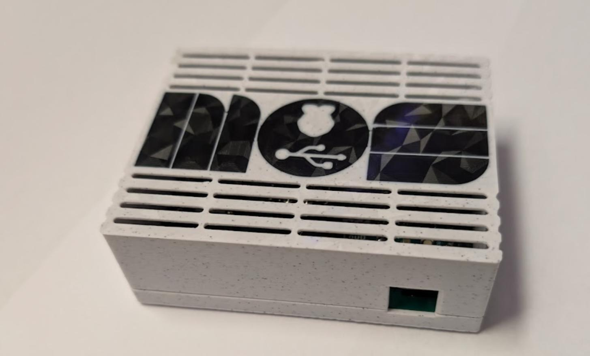
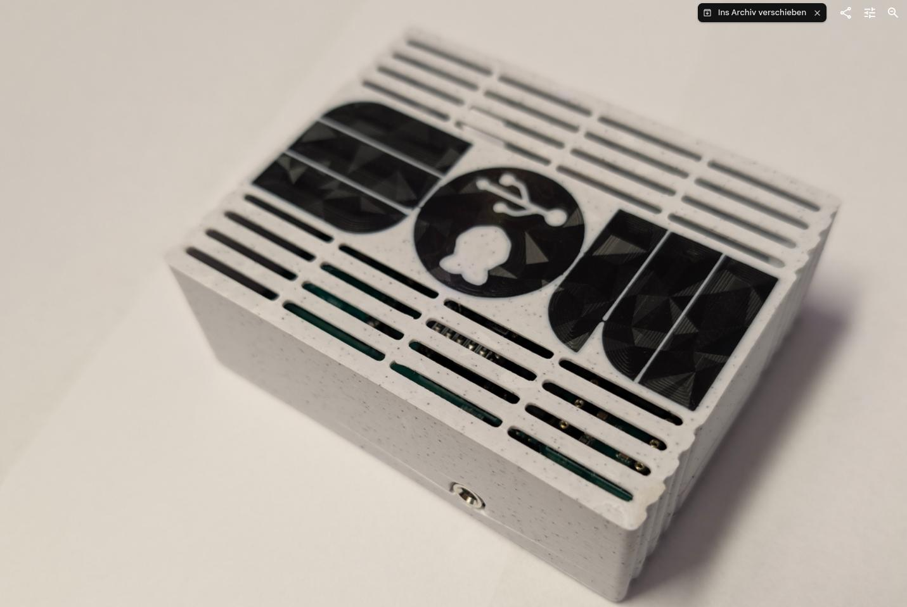
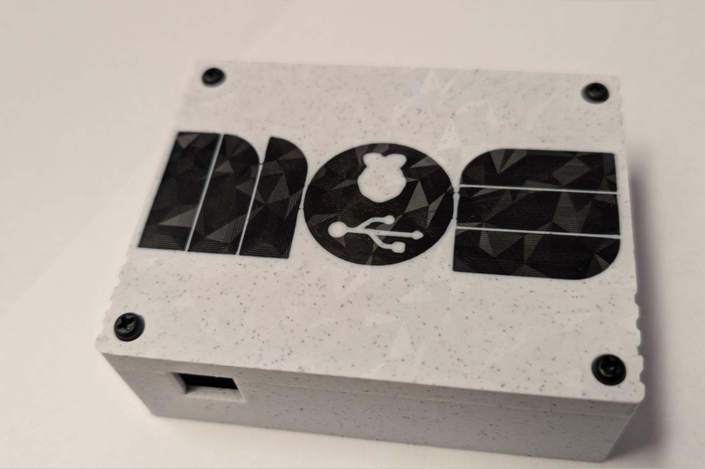

# 3D-Printed 'boxy' case for the USBSID-pico

# Printing

For printing all you need are the two `.stl` files.

Just print the top and bottom part without support laying on the flat side.

If you want to print a multicolor logo, of a logo cutout, just split the case in parts in your slicer and color or remove the logo.

# Assembly
You'll need 4 M3 screws, 10-15mm in length.

You can tap the holes or just force the screw in.

The Bulge at the Audioport is fixed by now.

