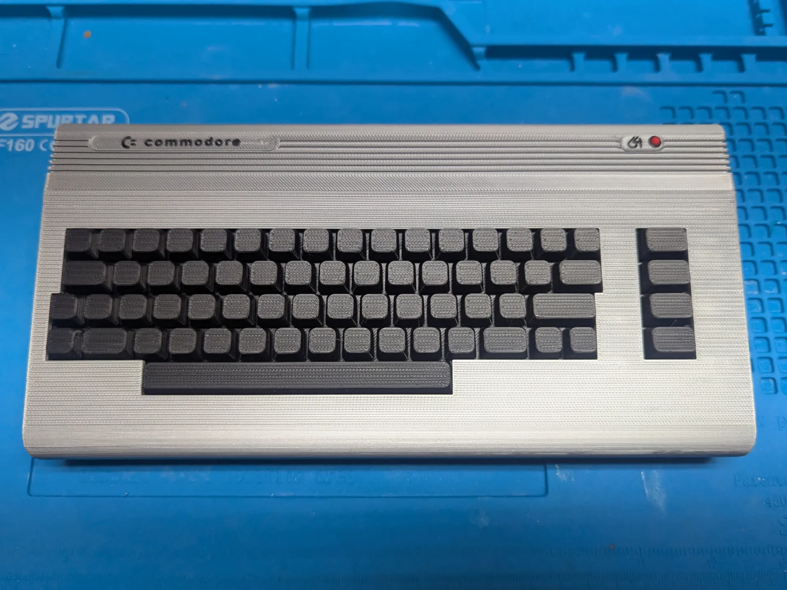
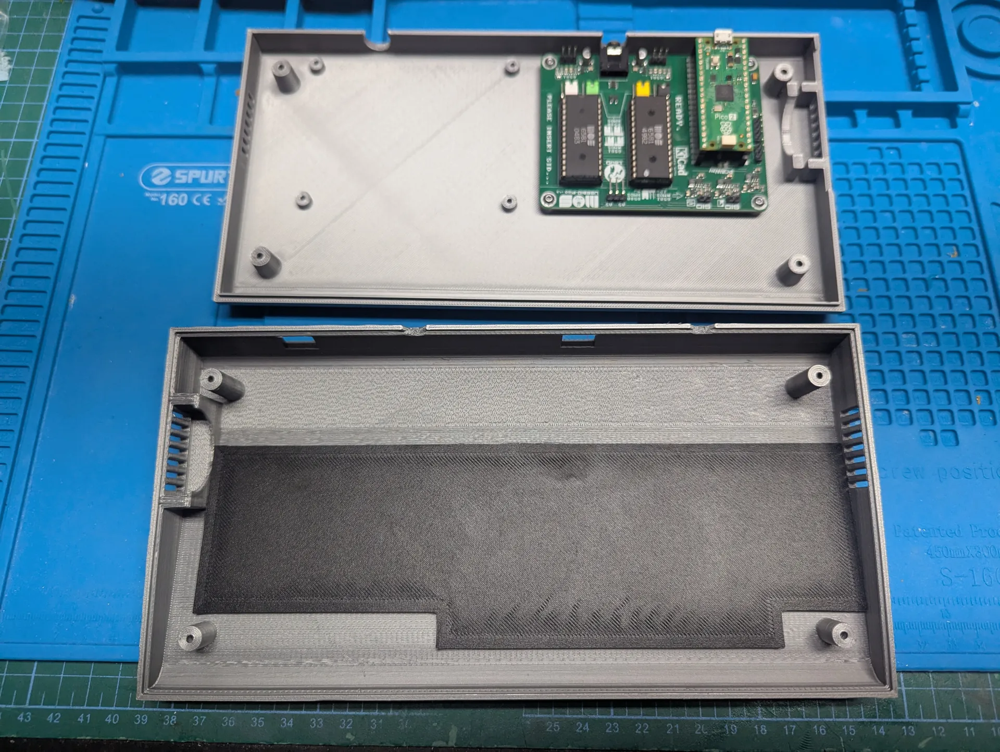
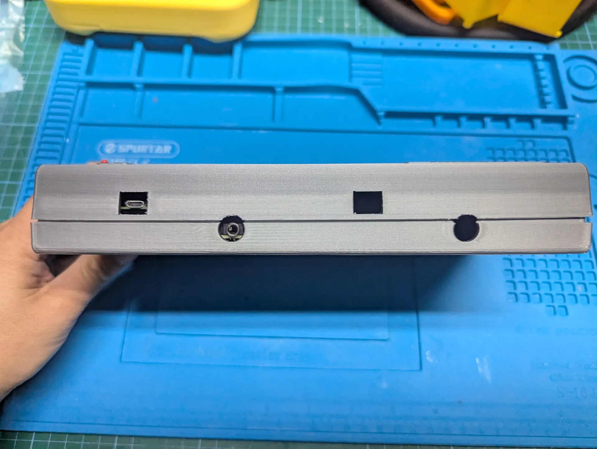

# Download
Download the case print files here:  
[Dual USBSID-Pico Commodore 64 Case](makerworld.com/en/models/1639001-dual-usbsid-pico-commodore-64-case)  
by [OlefinMakes](https://makerworld.com/en/@OlefinMakes) over at [MakerWorld](https://makerworld.com/en)

# Description
* This is a case that fits a pair of USBSID-Pico v1.3 PCBs, exposing 3.5mm and USB connectors to the rear of the case.
* The model was remixed from the [Commodore 64 case design by Nisoli Damiano](https://makerworld.com/en/models/891169-commodore-64-chassis) - it is 60% scale of the original, and able to print on an X1/P1 series printer.
* The case also has a slot for a 30x30x8mm fan - SID chips are known to get very toasty (65degC measured in my case). You will need to consider heat dissipation.
* This model is considered in beta - it is printable, however thermal management is still a WIP.

# Printing
* It is recommended to print these in a heat resistant filament - PETG, ABS, etc due to the hot SID chips. Heatsinks and a fan will also help avoid overheating inside the case.
* Due to the large area and aspect ratio of the parts, it is recommended to use a build plate treatment for good adhesion (such as gluestick), and to use the 20mm brim specified in the profile.
* Support reinforcers and blockers have already been added to the parts.
Take your time and exercise caution removing the supports from the top lid - you do not want to snap off the screw bosses from the top lid!

# Assembly
* The keyboard print is only designed to be superglued into place. Test fit to ensure it fits correctly prior to gluing. It will friction fit into place to aid assembly.
* The USBSID-Pico v1.3 PCBs fasten to the lower case using 4x M2.5x6mm BCHS per board. There is space for a pair of boards.
* Insert the 30x30x8mm fan into the lower case - you will need to provide for power as well (likely by tapping the Vbus pin on the Pi Pico for 5VDC directly). It is recommended to set the fan into ‘exhaust’ position, however slots have been placed on both sides to allow you to choose which direction the fan should flow, and route the power wires accordingly.
* Assemble the bottom and top halves, ensuring you get the fan aligned on both halves. Fasten the case together using 4x BT2.5x10 SHCS self tapping screws. Do not overtighten!

