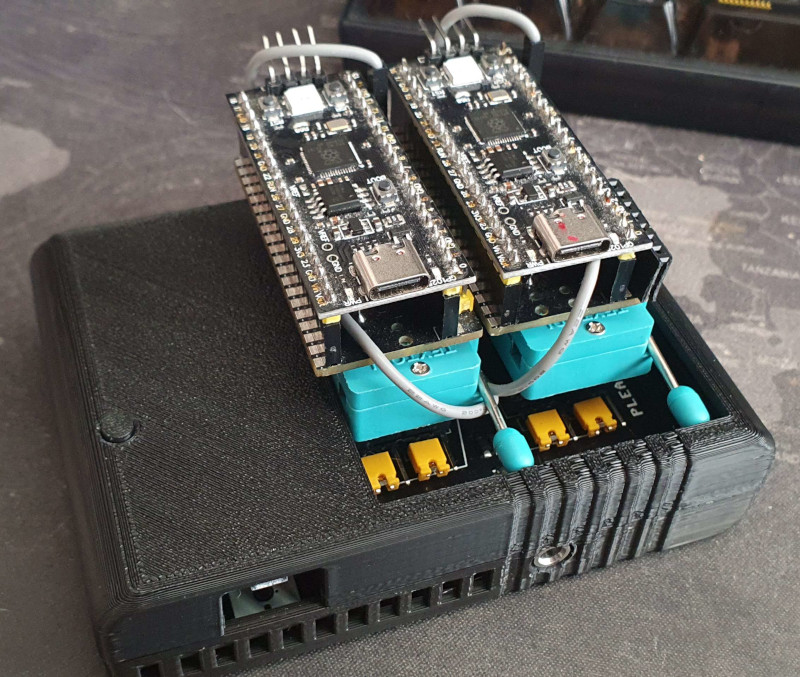

# Cartridge Case by spotUp revisited
- Updated to be v1.3 PCB compatible
- Optional reset button in top
- Design is opensource
Change the case to your liking on [Tinkercad](https://www.tinkercad.com/things/9WenaLv3th5-usbsid-pico-v13-case)
- Optional open top

