= *USBSID-Configtool manual*
:author: LouD
:description: This document contains information about the USBSID-Configtool and how to use it
:url-repo: https://www.github.com/LouDnl/USBSID-Configtool
:revdate: {localdate}
:hide-uri-scheme:
:toc:
:toclevels: 4
:toc-placement!:

Author: {author} - generated on {revdate}

toc::[]
[%always]
<<<

== Disclaimer
include::disclaimer.adoc[]

== About
What is there to say, you can configure your board with this tool and it is self explanatory.

== Screens

=== Welcome screen
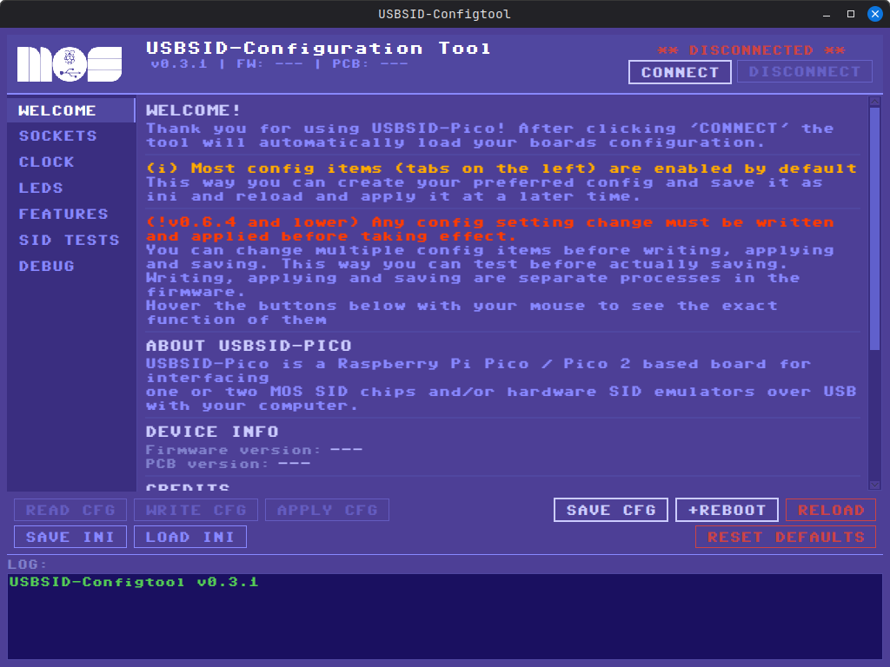 +
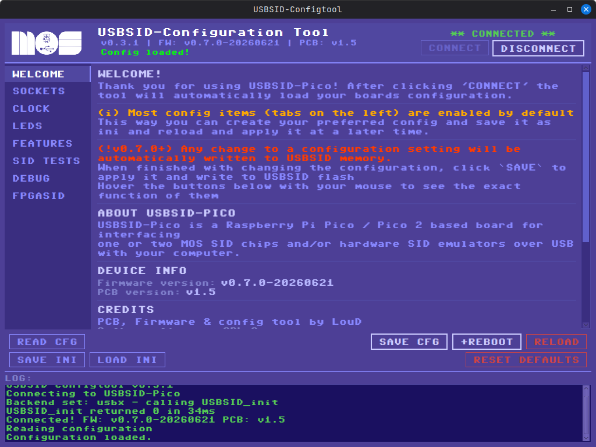 +
 +

=== v1.5 Sockets confirmation message
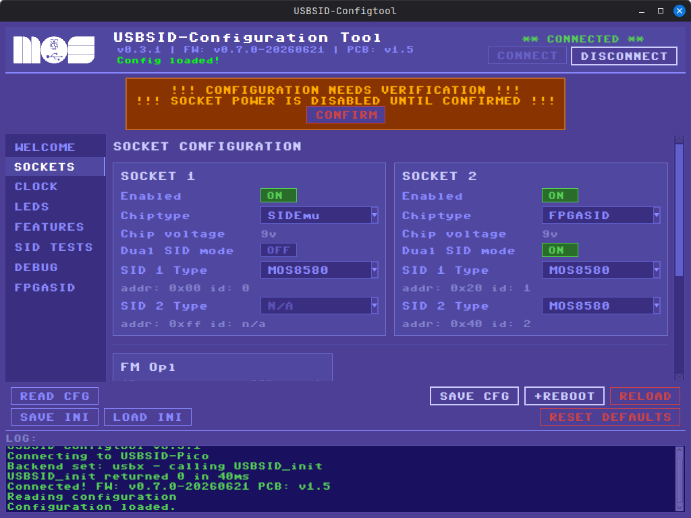 +

=== Sockets screen
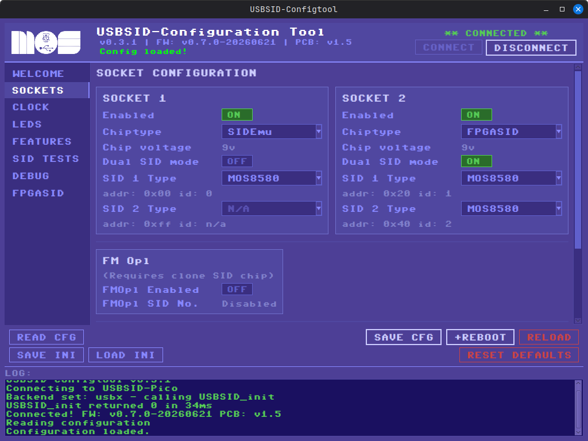 +
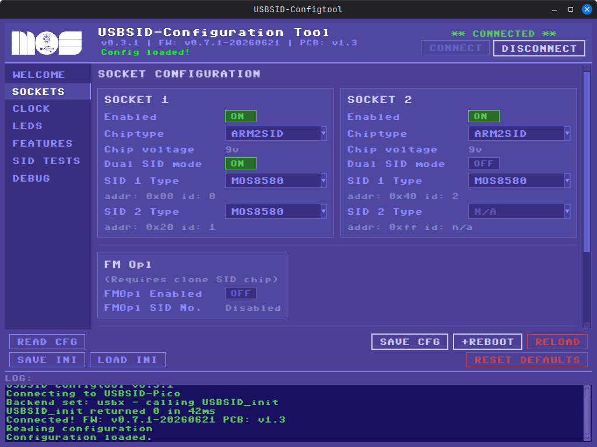 +

=== Clock screen
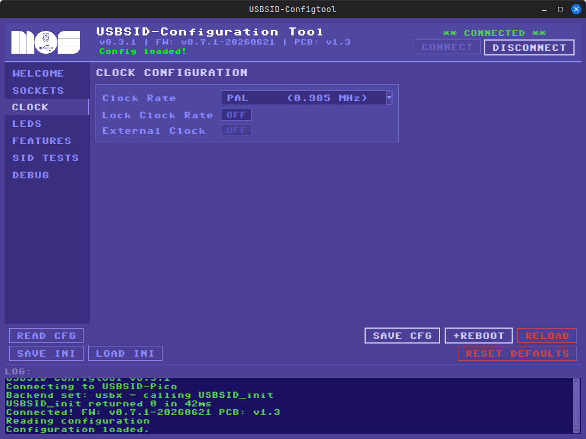 +

=== LEDS screen
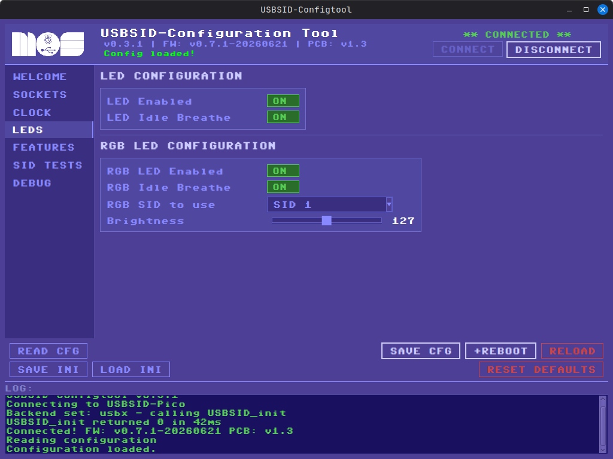 +

=== Features screen
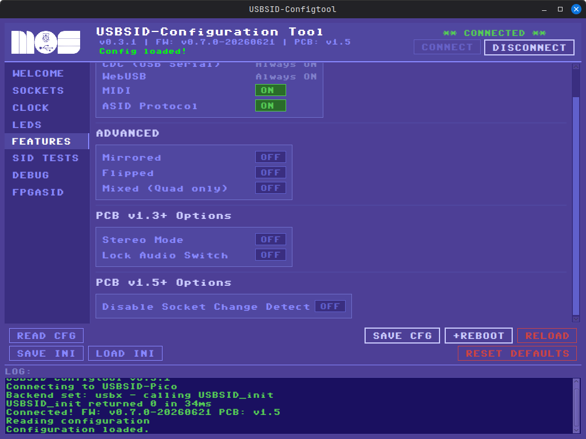 +
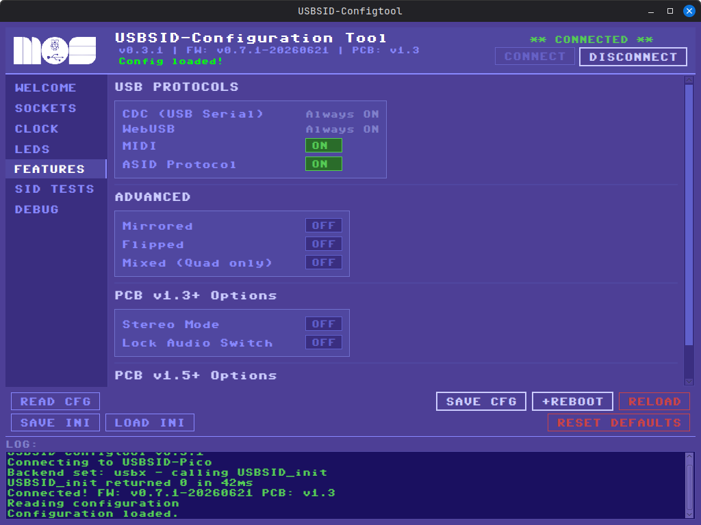 +

=== SID tests screen
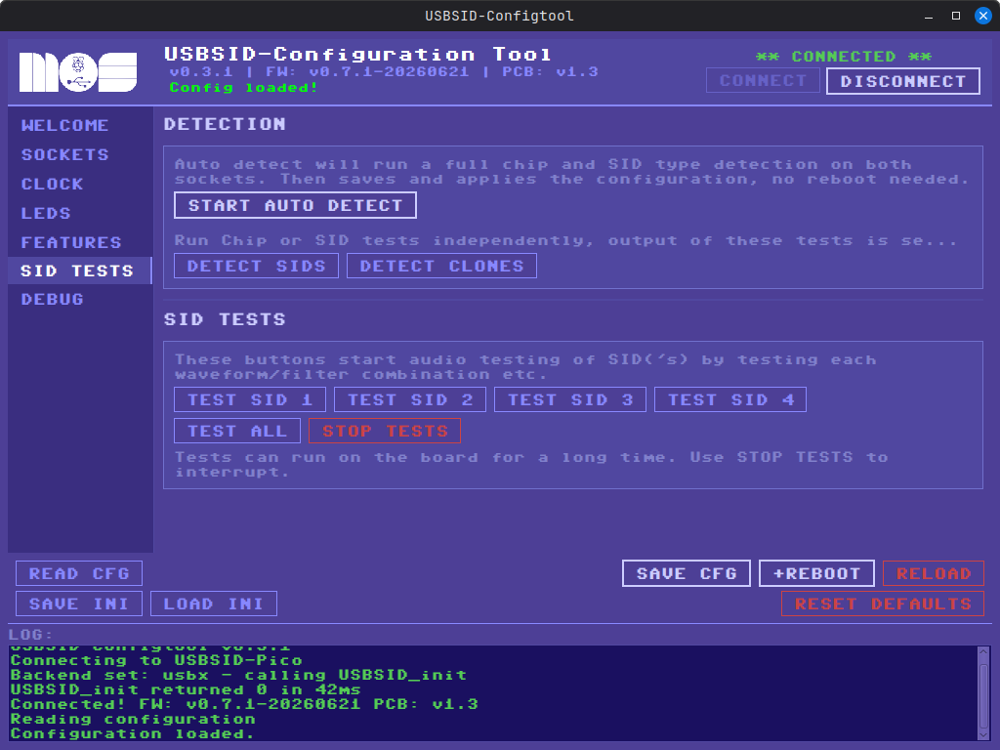 +

=== Debug screen
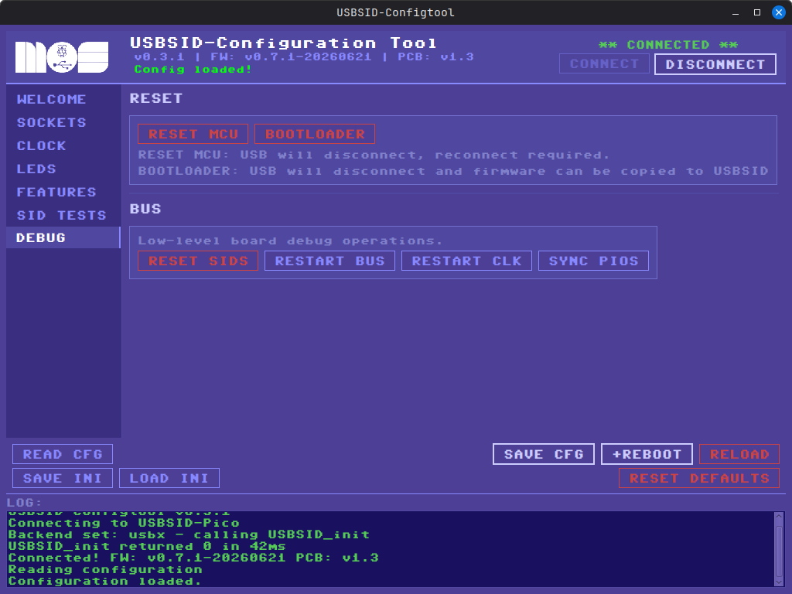 +

== Development
More information about USBSID-Configtool is available on the https://github.com/LouDnl/USBSID-Configtool[github repo]

== License
include::license-software.adoc[]

include::license-hardware.adoc[]

Author: {author} - generated on {revdate}
