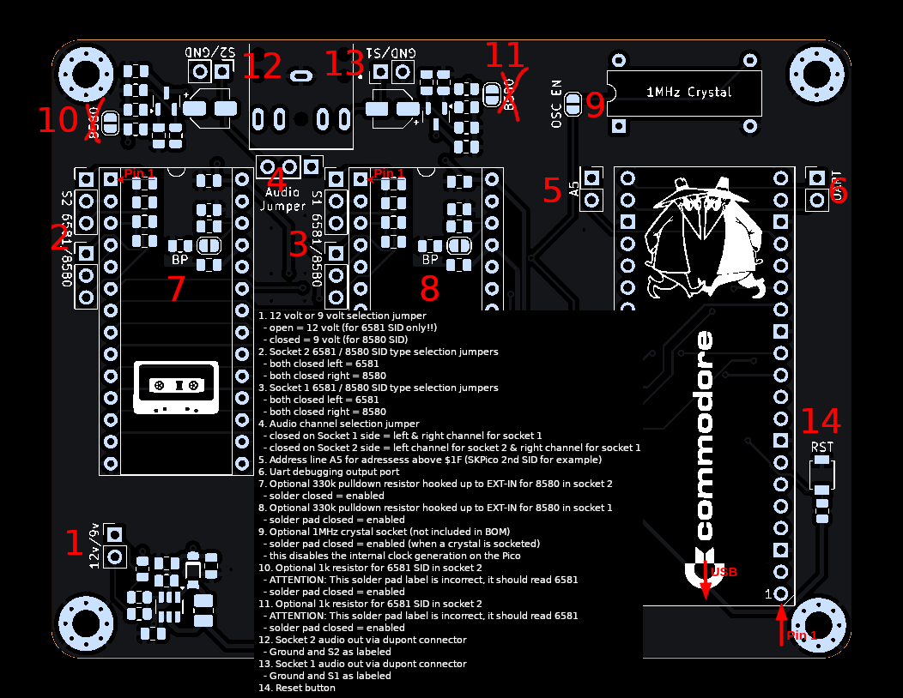

= *USBSID-Pico PCB revision v1.0 manual*
:author: LouD
:description: This document contains important information about USBSID-Pico PCB revision v1.0
:url-repo: https://www.github.com/LouDnl/USBSID-Pico
:revdate: {localdate}
:toc:
:toc-placement!:

toc::[]

Author: {author} - generated on {revdate}
[%always]
<<<

== PCB top overview
.Click image for larger view
[#img-v13top,link=images/v1.0/v1.0-explained.png]

[%always]
<<<

== RaspberryPi Pico placement orientation
In the placement overview image above there are 2 markings that designate toward what direction the Pico boards needs to be placed. +
The `USB` marking and arrow point in the direction towards where the Pico USB port needs to be. +
The `Pin 1` marking and arrow points towards where pin 1 of the Pico board needs to be.

== SID placement orientation
In the PCB overview image at the top of this document each SID socket has `Pin 1` marked with text and an arrow. +
Please use your full attention when placing your SID chips on the board so they in the correct orientation. +
_Incorrect placement orientation will result in frying your precious SID chip unicorn and creating a nice keychain!_
*_I am not responsible for your broken SID chips!_*

== 1. 12 volt or 9 volt selection jumper
image:images/v1.0/voltage-jumper-smaller.png[title=Voltage jumper] +

- open = for 6581 SID only!! (12 volts)
- closed = for 8580 SID (9 volts)

== 2. Socket 2 6581 / 8580 SID type selection jumpers
image:images/v1.0/SID2-jumper-smaller.png[title=SID2 selection jumper] +

- both closed left = 6581
- both closed right = 8580

== 3. Socket 1 6581 / 8580 SID type selection jumpers
 +

- both closed left = 6581
- both closed right = 8580

== 4. Audio channel selection jumper
image:images/v1.0/audio-jumper-smaller.png[title=Audio jumper] +

- closed on Socket 1 side = left & right channel for socket 1
- closed on Socket 2 side = left channel for socket 2 & right channel for socket 1

Optionally you could use a 3-way jumper cap for mono audio with both SID chips at the same time.

== 5. Address line A5
For adressess above $1F (SKPico 2nd SID for example) +
image:images/v1.0/A5-pins-smaller.png[title=Address 5 pins] +
Both pins are routed to the same GPIO for using adresses higher then $20

== 6. Uart debugging output port
image:images/v1.0/uart-port-smaller.png[title=UART port] +

- TX on the right
- RX on the left

== 7. Optional 330k pulldown resistor hooked up to EXT-IN for 8580 filter bypass in socket 2
image:images/v1.0/SID2-extin-bypass-smaller.png[title=EXTIN bypass] +
Solder pad closed = enabled

== 8. Optional 330k pulldown resistor hooked up to EXT-IN for 8580 filter bypass in socket 1
image:images/v1.0/SID1-extin-bypass-smaller.png[title=EXTIN bypass] +
Solder pad closed = enabled

== 9. Optional 1MHz crystal socket (not included in BOM)
image:images/v1.0/optional-crystal-smaller.png[title=Optional Crystal] +
Solder pad closed = enabled (when a crystal is socketed). +
This disables the internal clock generation on the Pico

== 10. Optional 1k resistor for 6581 SID in socket 2
 +
**ATTENTION!**: _On older v1.0 PCB's this solder pad is incorrectly labelled, it should read 6581!_ +
Solder pad closed = enabled

== 11. Optional 1k resistor for 6581 SID in socket 2
 +
**ATTENTION!**: _On older v1.0 PCB's this solder pad is incorrectly labelled, it should read 6581!_ +
Solder pad closed = enabled

== 12. Socket 2 audio out via dupont connector
image:images/v1.0/audio-out-smaller.png[title=Audio out] +
Socket 2 output to the right of the headphone jack +
Ground and S2 as labeled

== 13. Socket 1 audio out via dupont connector
image:images/v1.0/audio-out-smaller.png[title=Audio out] +
Socket 1 output to the left of the headphone jack +
Ground and S1 as labeled

== 14. Reset button

== Disclaimer
+++
include::disclaimer.html[]
+++

== License
=== Software License ~ GNUv2
+++
include::license-software.html[]
+++

=== Hardware License ~ Creative Commons
+++
include::license-hardware.html[]
+++

Author: {author} - generated on {revdate}
