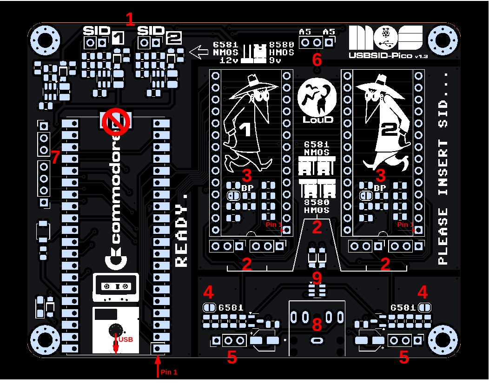

= *USBSID-Pico PCB revision v1.3 manual*
:author: LouD
:description: This document contains important information about the PCB
:url-repo: https://www.github.com/LouDnl/USBSID-Pico
:document-date: {localdatetime}

.Click image for larger view
[#img-v13top,link=images/v1.3/v1.3b-top-marked.png]

1. Socket SID type / voltage selection jumper +
image:images/v1.3/voltage-jumpers-1.jpg[Title=Voltage jumpers,240]
 +
Voltage control per SID/socket. +
_Please be careful and choose the right voltage setting!_ +
`SID1` is for socket 1 (left) and `SID2` is for socket 2 (right)
- No jumper cap (open) = for `6581` SID only!! (12 volts)
- Jumper cap (closed) = for `8580` SID (9 volts)
- Most clone SID chips do not use the higher voltage pin. +
Please check with the manufacturers manual if you are not sure!
2. SID filter selection jumpers +
image:images/v1.3/SID-sockets-1.jpg[title=SID filter selection jumpers,240]
image:images/v1.3/SID-sockets-2.jpg[title=SID filter selection jumpers,240] +
Each socket has 2 jumpers that need to be in the same position. These jumpers control which filter capacitors are active for that socket. +
Accidentally mixing these jumpers should not do any harm but might make audio sound worse.
  - Jumpers on the left (closed) = `6581` filters (`470pF`)
  - Jumpers on the right (closed) = `8580` filters (`22nF`)
3. Audio circuit +
 +
Each socket has it's own audio circuit with a voltage follower audio filter. This is also used in the Commodore64 and on the SID Blaster. +
4. For each circuit there is a solder pad marked `6581`, this is an extra pull down resisitor required when using a `MOS6581` SID.
5. Each socket also has an optional header with 3 pins. The pinout is from left to right `GND,IN,OUT` (markings are on the bottom of the PCB) +
 +
On the bottom of the PCB each socket as a solder pad marked `EXT IN`. Close this to connect the `IN` pin of the audio header to the SID chip `EXT-IN` pin. *You have to provide the audio in filter!* +
 +
*_I take no responsibility for you breaking your SID chip by using this!_*
6. Inside each socket there is a solderpad marked `BP`. This provides an optional filter bypass by decoupling `EXT-IN` to `GND` with a 330k resistor. Also known as `digi-boost` for `8580` SID chips.
7. Optional header for connecting the `A5` address line to Clone SID chips. There are 2 `A5` pins, one for each socket that are both connected to the same GPIO pin. The pinout is from left to right `A5,SW,A5` (markings are on the bottom of the PCB) +
 +
The `SW` pin is an optional pin for adding a switch to control the mono / audio switch manually.
8. Optional header for UART pins and unused GPIO for future use (markings are on the bottom of the PCB)
9. Last but not least, the digital audio switch IC. Switching from mono (both SID chips play over left and right) to Stereo (SID1 over the left channel and SID2 over the right channel) and back is handled by the firmware through settings or automatically by supported players.

.Click image for larger view
[#img-v13bottom,link=images/v1.3/v1.3b-bottom.png]

Author: {author} - generated on {document-date}
