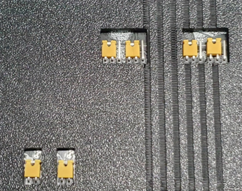

= *USBSID-Pico PCB revision v1.3 manual*
:author: LouD
:description: This document contains important information about USBSID-Pico PCB revision v1.3
:url-repo: https://www.github.com/LouDnl/USBSID-Pico
:revdate: {localdate}
:toc:
:toc-placement!:

Author: {author} - generated on {revdate}

toc::[]
[%always]
<<<

== PCB top overview
.Click image for larger view
[#img-v13top,link=images/v1.3/v1.3b-top-marked.png]
image::images/v1.3/v1.3b-top-marked.png[title=PCB top overview]

[%always]
<<<

== RaspberryPi Pico placement orientation
In the PCB overview image at the top of this document there are 2 markings that designate toward what direction the Pico boards needs to be placed. +
The `USB` marking and arrow point in the direction towards where the Pico USB port needs to be. +
The `Pin 1` marking and arrow points towards where pin 1 of the Pico board needs to be.

== Optional Pico placements
The USBSID-Pico v1.3 PCB has the option for you to solder your Pico directly to the PCB using the Pico's castelated edges. +
This creates more space and can be useful if you want to use a SID clone like FPGASID in socket 1.
[.float-group]
--
[.left]

The Pico debug pins are not connected and not used, you do not have to solder these pins.
--

== Optional header placement
If you would like to use a (semi)closed case like the spotUP case but want to keep access to the filter and power jumpers, +
it's possible to solder the jumper headers on the bottom side of the PCB for easy access. +
There is a bottom case STL available that has special openings for this like in the photo below. +

== SID placement orientation
In the PCB overview image at the top of this document each SID socket has `Pin 1` marked with text and an arrow. +
Please use your full attention when placing your SID chips on the board so they in the correct orientation. +
_Incorrect placement orientation will result in frying your precious SID chip unicorn and creating a nice keychain!_
*_I am not responsible for your broken SID chips!_*

== 1. Socket SID type / voltage selection jumper

image:images/v1.3/voltage-jumpers-2.jpg[Title=Voltage jumpers,240] +
Voltage control per SID/socket.

.`SID1` is for socket 1 (left) and `SID2` is for socket 2 (right)
* No jumper cap (open) = for `6581` SID only!! (`12 volts`)
* Jumper cap (closed) = for `8580` SID (`9 volts`)
//-

_Please be careful and choose the correct voltage setting!_ +
 +
_Note:_ +
_Most clone SID chips do not use the higher voltage pin. Please check with the SID clone manufacturer (manual) if you are not sure!_

== 2. SID filter selection jumpers

 +

[.float-group]
--
[.left]

Each socket has 2 jumpers that need to be in the same position. +
These 2 jumpers control which filter capacitors are active for that socket. +
The 2 left jumpers are for `SID1/socket1` and the 2 right jumpers are for `SID2/socket2`
--

* 2 jumpers left (closed) = `MOS6581` filters (`470pF`)
* 2 jumpers right (closed) = `MOS8580` filters (`22nF`)
//-

*Accidentally mixing these jumpers should not do any harm but might make audio sound worse.* +
_Note:_ +
_Most clone SID chips do not use the filter capacitors. Please check with the SID clone manufacturer (manual) if you are not sure!_ +
_Each set of jumpers respectively controls the capacitance for `CAPA` and `CAPB` for that SID._ +

== 3. Digiboost
[.float-group]
--
[.left]

Inside each SID socket there is a solderpad marked `BP`. This provides an optional bypass by directly pulling SID Pin 26 `EXT IN` to `GND` with a 330k resistor.
--
This bypass is also known as `digi-boost` for `8580` SID chips. +
_Note:_ +
_The digiboost resistor value is fixed._

== 4. `6581` pulldown resistor
[.float-group]
--
[.left]

For each audio circuit there is a solder pad marked `6581`.
--
This is an extra pull down resisitor required when using a `MOS6581` SID as per Commodore64 schematic. +
_Note:_ +
_Your `6581` SID will work without this solderpad but audio quality may vary._

== 5. Audio pins
[.float-group]
--
[.left]
image:images/v1.3/audio-pinout.jpg[Title=Audio pinout,role=left]
Each socket has an optional header with 3 pins. +
The pinout is from left to right `GND,IN,OUT` +
_(markings are on the bottom of the PCB)_
--

[.float-group]
--
[.left]
image:images/v1.3/solderjumper-ext-in.jpg[Title=EXT IN,role=left]
Each socket has a solder pad marked `EXT IN` on the bottom of the PCB. +
Close this to connect the `IN` pin of the audio header to the SID chip `EXT IN` pin.
--

*IMPORTANT:* +
*There is no audio filter circuit connected to the EXT IN pin, you have to provide the audio in filter yourself!* +
*_I take no responsibility if you break your SID chip by using this pin!_*

== 6. Address line & audio switch pins
[.float-group]
--
[.left]
image:images/v1.3/a5-switch.jpg[Title=Address lines and audio switch,role=left]
Optional header for connecting the `A5` address line to Clone SID chips. +
There are 2 `A5` pins, one for each socket that are both connected to the same GPIO pin. +
The pinout is from left to right `A5,SW,A5` +
_(markings are on the bottom of the PCB)_
--
The `SW` pin is an optional pin for adding a switch to control the mono / audio switch manually.

== 7. GPIO pins
Optional header for UART pins and unused GPIO for future use. +
_(markings are on the bottom of the PCB)_

== 8. Audio circuit
[.float-group]
--
[.left]
image:images/v1.3/audio-circuit.jpg[title=Audio circuit,320,role=left]
Each socket has it's own audio circuit with a voltage follower audio filter. +
This is also used in the Commodore64 and on the SID Blaster.
--

== 9. Audio switch
Last but not least, the digital audio switch IC. Switching from mono (both SID chips play over left and right) to Stereo (SID1 over the left channel and SID2 over the right channel) and back is handled by the firmware through settings or automatically by supported players.

[%always]
<<<

== PCB bottom overview
.Click image for larger view
[#img-v13bottom,link=images/v1.3/v1.3b-bottom.png]
image::images/v1.3/v1.3b-bottom.png[title=PCB bottom overview]

== Disclaimer
include::disclaimer.adoc[]

== License
=== Software License ~ GNUv2
include::license-software.adoc[]

=== Hardware License ~ Creative Commons
include::license-hardware.adoc[]

Author: {author} - generated on {revdate}
