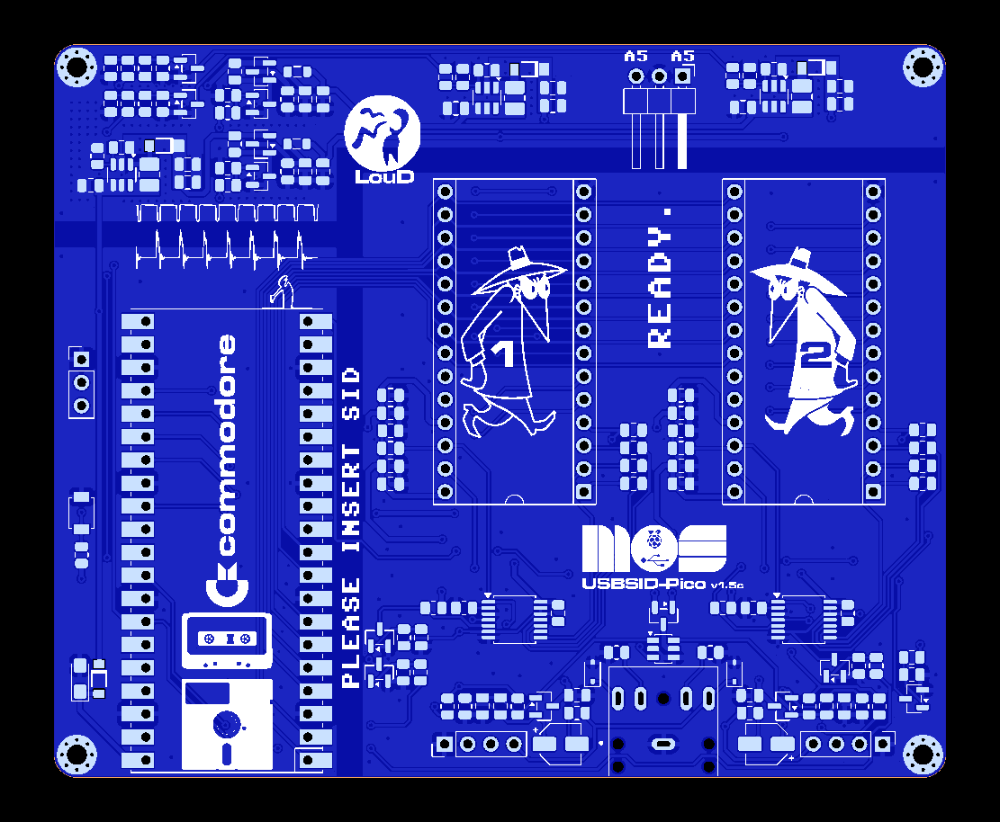
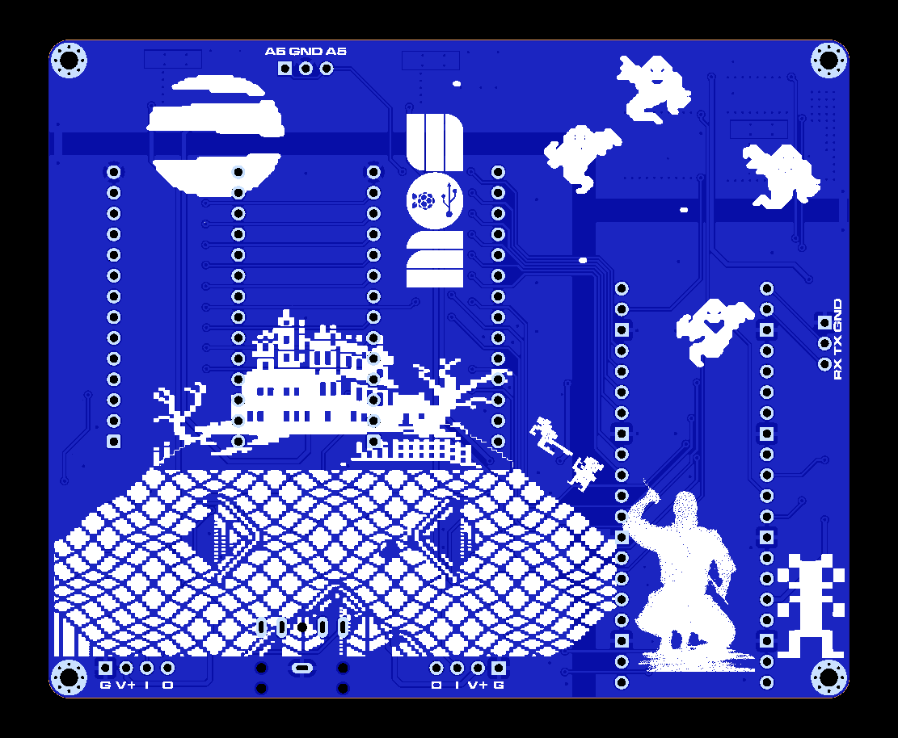

= *USBSID-Pico PCB revision v1.5 manual*
:author: LouD
:description: This document contains important information about USBSID-Pico PCB revision v1.5
:url-repo: https://www.github.com/LouDnl/USBSID-Pico
:revdate: {localdate}
:toc:
:toc-placement!:

Author: {author} - generated on {revdate}

toc::[]
[%always]
<<<

== Disclaimer
include::disclaimer.adoc[]

== PCB top overview
.Click image for larger view
[#img-v15top,link=images/v1.5/v1.5c-top.png]

[%always]
<<<

== Extra protection
The audio out jack and pins are now protected with ESD protection diodes. +
And the left and right channel in the audio jack will be pulled to ground with a 10k softpull resistor when no jack is inserted by using the jack switches.

== Jumperless design
The v1.5 board is a jumperless design. This means that settings that were previously controlled with jumpers are now configured with settings in the firmware. The settings can be configured with the USBSID-Configtool. +

== Automatic settings
In line with the jumperless design some settings are set automatically. +

SID type controls the voltage: +
- The firmware will do a chip detect on startup to figure out if there is a clone chip or a real SID and what real SID is seated. +
- This detection routine detects any change on startup and will lock the board with a blinking LED indicating you need to verify the socket configuration in the configtool. +
- 8580 means 9 volts +
- 6581 means 12 volts +
- All clone SID chips will be automatically powered with 9 volts. +
- It is possible to turn off this detection routine at startup and override the voltage setting. +

SID type also controls the filter capacitor setting, the 8580 digiboost resistor and 6581 shunt resistor: +
- 8580 means automatic digiboost and 22nF filter capacitors +
- 6581 means no digiboost, shunt resistor enabled and 470pF filter capacitors +

== RaspberryPi Pico placement orientation
In the PCB overview image at the top of this document there are 2 ways from which you can get what direction the Pico boards needs to be placed. +
The `diskette` marking is where the Pico USB port needs to be. +
The `Pin 1` marking, the little square around the solder pad at the outer edge of the board is where the Pico USB port needs to be.

== Optional Pico placements
The USBSID-Pico v1.3 PCB has the option for you to solder your Pico directly to the PCB using the Pico's castelated edges. +
This creates more space and can be useful if you want to use a SID clone like FPGASID in socket 1.

== SID placement orientation
In the PCB overview image at the top of this document each SID socket has a little cut out which indicates the SID placement orientation. +
Please use your full attention when placing your SID chips on the board so they are in the correct orientation. +
_Incorrect placement orientation will result in frying your precious SID chip unicorn and creating a nice keychain!_
*_I am not responsible for your broken SID chips!_*

== Address line
The pins at the top of the board marked with A5 are for connecting an optional extra wire for some clone SID chips that support a second SID.

==  Audio pins
Each SID socket has an optional header with 4 pins. +
The pinout for SID1 is from left to right `VDD,GND,IN,OUT` +
And the pinout for SID2 is from left to right `OUT,IN,GND,VDD` +
_(markings are on the bottom of the PCB)_
*IMPORTANT:* +
*There is no audio filter circuit connected to the EXT IN pin, you have to provide the audio in filter yourself!* +
*_I take no responsibility if you break your SID chip by using this pin!_*

== UART pins
Optional header for UART pins. +
_(markings are on the bottom of the PCB)_

[%always]
<<<

== PCB bottom overview
.Click image for larger view
[#img-v15bottom,link=images/v1.5/v1.5c-bottom.png]

== License
include::license-software.adoc[]

include::license-hardware.adoc[]

Author: {author} - generated on {revdate}
