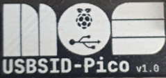
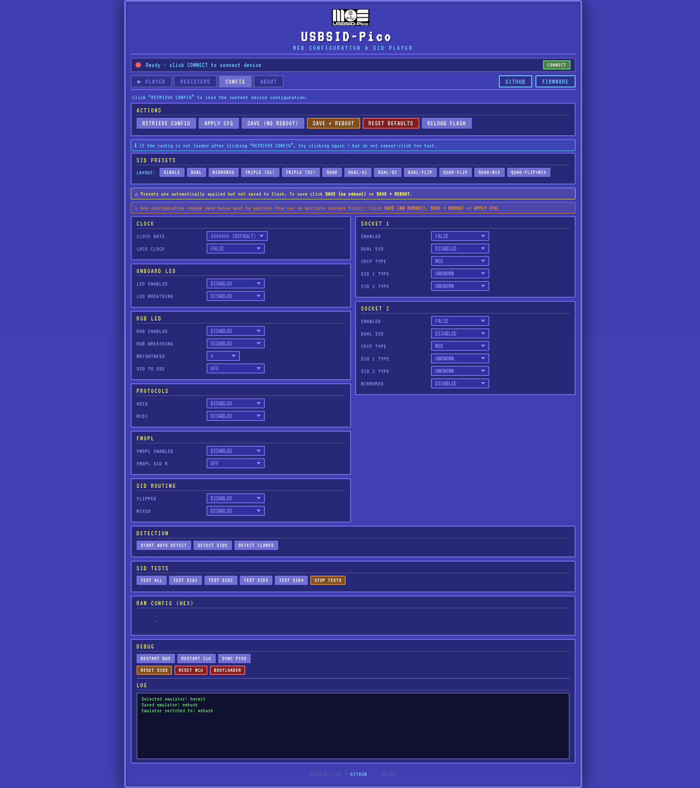
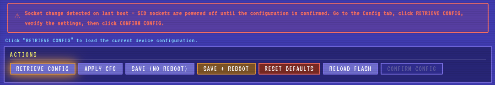
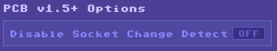
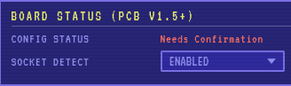

= *USBSID-Pico PCB firmware manual*
:author: LouD
:description: This document contains important information about the USBSID-Pico firmware & configuration
:url-repo: https://www.github.com/LouDnl/USBSID-Pico
:revdate: {localdate}
:hide-uri-scheme:
:toc:
:toclevels: 4
:toc-placement!:

Author: {author} - generated on {revdate}

toc::[]
[%always]
<<<

== Disclaimer
include::disclaimer.adoc[]

== Firmware types

 +
Each PCB revision is the firmware designator, please check your PCB revision, this is under the MOS logo and next to *USBSID-Pico* on your PCB. +
Firmware filenames contain the PCB revision number e.g. `usbsidpico-rgb-v1.X.uf2` is for PCB revision `v1.0` and for use with a black clone Pico containing an RGB LED.

== Firmware naming
Below are the filenames used for each Pico and board type, take great care in selecting the correct file for you Pico! +
**WARNING!** Do _NOT_ use the **RGB** firmware for any of the (non black) rp2040 or (non black) rp2350 Pico boards that do not contain an RGB LED, this can break your Pico! +

=== Board revision
The 1.X in each filename equals for the PCB revision as mentioned under firmware types. Don't worry if you flash a firmware for the incorrect PCB revision, this causes no harm. +

=== Firmware naming
`usbsidA-BC.uf2` examples: `usbsidpico-v1.0-rgb.uf2`, `usbsidpico2_w-v1.3.uf2` or `usbsidpico2-v1.5-rgb_sp`. +
A: The pico board type e.g. `pico`, `pico2`, `pico_2` or `pico2_w` +
B: The PCB version e.g. `v1.0`, `v1.3` or `v1.5` +
C: A combination of optional features e.g. `-rgb`, `_em` or `_sp`

=== Firmware naming per Pico type
Firmwares suitable for rp2040 Pico1 boards start with `usbsidpico-`
Firmwares suitable for rp2040 Pico1_w boards start with `usbsidpico_2-` +
Firmwares suitable for rp2350 Pico2 boards start with `usbsidpico2-` +
Firmwares suitable for rp2350 Pico2_w boards start with `usbsidpico2_w-` +

=== Naming examples for the rp2040 Pico1
Firmware naming suited for the pico 1 always start with `usbsidpico-` +
`usbsidpico-v1.X.uf2` for regular green rp2040 Pico boards. +
`usbsidpico-rgb-v1.X.uf2` for black clone rp2040 Pico boards with RGB LED onboard. +
`usbsidpico_w-v1.X.uf2` for regular green rp2040 PicoW boards.

=== Naming examples for the rp2350 Pico2
Firmware naming suited for the pico 2 always start with `usbsidpico2-` +
`usbsidpico2-v1.X.uf2` for regular green rp2350 Pico2 boards. +
`usbsidpico2-rgb-v1.X.uf2` for black clone rp2350 Pico2 boards with RGB LED onboard. +
`usbsidpico2_w-v1.X.uf2` for regular green rp2350 Pico2W boards.

=== Firmwares with Cynthcart embedded
Starting with firmware version v0.6.0-BETA firmwares ending with `_em` have an embedded emulator running Cynthcart. +
For example `usbsidpico-v1.0_em.uf2` or `usbsidpico2-rgb-v1.3_em.uf2` +
See the `USBSID-Pico-Cynthcart-manual` file for more information.

=== Firmwares with embedded USBSID-Player
Starting with firmware version v0.6.0-BETA firmwares ending with `_sp` have an embedded emulator that can play PSID and RSID tunes and PSID64 PRG/P00 files. +
For example `usbsidpico2-v1.0_sp.uf2` or `usbsidpico2-v1.3-rgb_sp.uf2` +
This USBSID-Player is still in active development and some tunes might not work or play at all. +
The embedded USBSID-Player requires more then 256KB RAM and an overclocked CPU which makes this firmware only available for rp2350 Pico2 boards. +
See the `USBSID-Player-manual` file for more information.

== How to flash your Pico
**NOTE**: +
[.underline]#When flashing a new firmware version, all previously configured settings will be reset to default. Use the commandline configtool to save your current settings to a `ini` file if you want to save them!# +
A Raspberry Pi Pico board is incredibly easy to flash, as it comes with a built in bootloader for flashing new firmwares in the `uf2` format. +
In order to flash a new firmware to your USBSID-Pico you will need to put the Pico into bootloader mode. +
This can be done in multiple ways:

With the cable already plugged into your computer and Pico and seated on the board (using buttons):

- Press and hold the `BOOTSEL` button on the Pico.
- Press and release the `RST` button on the USBSID-Pico board.
- Now release the `BOOTSEL` button.
- A new drive should appear on your computer called `RPI-RP2` or `RP2350` depending on your Pico type.
- Copy the correct `uf2` firmware file to this directory.
- After copying the Pico will reboot and your Pico is flashed.

With the cable not plugged in to your computer and Pico and also not seated on the board (using buttons):

- Plug in the USB cable to your Pico and not into your computer.
- While holding the `BOOTSEL` button on the Pico plugin the other end of the USB cable into your computer.
- Now release the `BOOTSEL` button.
- A new drive should appear on your computer called `RPI-RP2` or `RP2350` depending on your Pico type.
- Copy the correct `uf2` firmware file to this directory.
- After copying the Pico will reboot and your Pico is flashed.

With the cable already plugged into your computer and Pico and seated on the board (using software):

- With the GUI config tool
- Go to the `DEBUG` tab and click on `BOOTLOADER`
- A new drive should appear on your computer called `RPI-RP2` or `RP2350` depending on your Pico type.
- Copy the correct `uf2` firmware file to this directory.
- After copying the Pico will reboot and your Pico is flashed.

or

- Go to the config webpage (https://usbsid.loudai.nl/index.html?player=webusb&debug=usbsidpico):
- Connect to the board using `WebUSB (Hermit)` as emulator
- Click on `CONFIG` to open the configuration tab
- Scroll to the bottom of the page and click on `BOOTLOADER` in the box named `DEBUG`
- A new drive should appear on your computer called `RPI-RP2` or `RP2350` depending on your Pico type.
- Copy the correct `uf2` firmware file to this directory.
- After copying the Pico will reboot and your Pico is flashed.

or

- With the CLI config tool command in your `PATH` variable
- Type `cfg_usbsid -boot` to send the reboot to bootloader command
- A new drive should appear on your computer called `RPI-RP2` or `RP2350` depending on your Pico type.
- Copy the correct `uf2` firmware file to this directory.
- After copying the Pico will reboot and your Pico is flashed.

== Firmware configuration
USBSID-Pico has an extensive set of configuration options that expands with each firmware release. +

=== USBSID-Pico-Configtool
You can configurate your board by using the official USBSID-Pico-Configtool +
The tool is available here https://github.com/LouDnl/USBSID-Pico-Configtool[USBSID-Pico-Configtool] in the releases section

=== Commandline configuration tool
You can configurate your board with:
  - the commandline config-tool
  - the commandline config-tool with the Python Configuration GUI by ISL/Samar if you prefer a GUI.

==== Python Configuration GUI downloads
https://github.com/LouDnl/USBSID-Pico/blob/master/examples/config-tool/cfg_usbsid_GUI.py[Download script] +
Python3 -> https://www.python.org/downloads/[Download] +
TkInter -> https://tkdocs.com/tutorial/install.html[Installation guide] +
And either one of the Linux or Windows CLI downloads below

==== Linux / Windows downloads
The latest version of the CLI config tool is available in a zip file called `tools.zip` from release v0.6.0-BETA and up

==== Windows downloads
If the DLL's are missing from the zip file you can always download them from here: +
https://github.com/LouDnl/USBSID-Pico/blob/master/examples/config-tool/libusb-1.0.dll[Download DLL 1] +
https://github.com/LouDnl/USBSID-Pico/blob/master/examples/config-tool/libwinpthread-1.dll[Download DLL 2]

=== Configuration web page (for Chrome/Edge based browsers using webusb)
https://usbsid.loudai.nl/?player=webusb[USBSID web configuration tool] (requires a Chrome based browser). +
If needed you can change your USBSID configuration after selecting WebUSB and clicking on `Open config`. +
 +
_The player is set up with borrowed code from Deepsid using Hermit's JsSID implementation._

=== Default configuration (depends on the board version)
Each firmware version comes with the same default configuration. +
An explanation for these settings can be found further on in this document. +
Board clock rate: `1000000Hz` +
Clock rate locked: `False` +
Audio mode: `Mono` +
Socket One Enabled: `True` +
Socket One Dualsid enabled: `False` +
Socket One Chiptype: `Real` +
Socket One Clonetype: `Disabled` +
Socket One SID 1 type: `UNKNOWN` +
Socket One SID 1 type: `N/A` +
Socket Two Enabled: `True` +
Socket Two Dualsid enabled: `False` +
Socket Two Chiptype: `Real` +
Socket Two Clonetype: `Disabled` +
Socket Two SID 1 type: `UNKNOWN` +
Socket Two SID 1 type: `N/A` +
Socket Two Act as One: `False` +
LED Enabled: `True` +
LED Idle breathe enabled: `True` +
RGBLED Enabled: `False` (`True` for RGB Pico's) +
RGBLED Idle breathe enabled: `False`  (`True` for RGB Pico's) +
RGBLED Brightness: `0` (`127` for RGB Pico's) +
RGBLED SID to use: `-1` (`1` for RGB Pico's) +
CDC Enabled: `True` +
WebUSB Enabled: `True` +
Asid Enabled: `True` +
Midi Enabled: `True` +
FMOpl Enabled: `False` +
FMOpl SID no: `0`

=== Board clock rate
The Commodore64 has different clockrates depending on where you live, USBSID-Pico supports these different clock rates as configuration setting. +
Supported SID players will automatically send a new clock rate request to the board to switch to. +
Available options are: +
`DEFAULT 1000000Hz`, `PAL 985248Hz`, `NTSC 1022727`, `DREAN 1023440`, `NTSC2 1022730`

=== Clock rate locked
Some players start sending data directly after the clockrate is changed. While in most cases this is no issue, some SID clones need some time to start up. This causes issues when the clock rate is changed on the fly. +
Also changing the clock rate multiple times after another can cause data corruption to the SID which causes garbled sound. +
To overcome this it is possible to lock the clockrate to the current setting it is set to. This blocks the ability for on the fly change requests. +
Available options are: +
`False`, `True`

=== Audio mode
_PCB revision v1.3 only_ +
Sets the audio mode for the headphone jack and audio out pins. +
When set to `Mono` the audio of both SID sockets will be combined to mono. +
When set to `Stereo` the audio of both SID sockets will be separated into left for `SID1` and right for `SID2` +
Available options are: +
`Mono`, `Stereo`

=== SID Voltage & Configuration confirmation
_PCB revision v1.5 only_ +
The board boots with 5v and 9v enabled to automatically detect any changes in the socket / chip configuration, it does this by running a chip and SID detection. +
When a change is detected the boards turns off the 9v and 5v and the onboard (RGB)LED starts flashing, making the board unusable until the configuration is validated and confirmed. +
_Please verify the configuration with care before confirming, failure to do so might damage/kill your SID chips, and we don't want that!_ +
There are multiple ways to validate and confirm the configuration: +
**GUI Configtool** +
On opening the configtool and connecting to the board there will be a text stating the configuration needs to be confirmed. Verify the config on the `SOCKETS` tab and when done click `CONFIRM` +
 +
**Web Configtool** +
On opening the config website and connecting to the board there will be a text stating the configuration needs to be confirmed. Verify the config on the `CONFIG` tab by clicking `RETRIEVE CONFIG` first and when done validating click `CONFIRM CONFIG`. Both buttons will glow when a click is needed +
 +
**CLI Configtool** +
First read the configuration with `cfg_usbsid -r`, the printed configuration will have a line that states the config needs confirmation. You can do this with `cfg_usbsid -ack`.

=== Disable socket change detection
_PCB revision v1.5 only_ +
When you have a fixed socket setup, e.g. you do not plan on changing the chips anytime soon, it is possible to disable the change detection on boot. This will make the board start up with 5v and 9v and then - if 12v is required - switch to the required voltage setting during the boot process by switching the voltage back off, setting the correct hv voltage and then switching it back on. +
When the socket detection _is_ on, the board will _always_ try to detect any changes in the configuration _before_ the required voltage is applied. +
By setting the `Disable socket detection on boot` option you can control the above behaviour: +
**GUI Configtool** +
 +
**Web Configtool** +
 +
**CLI Configtool** +
Change the behaviour with `cfg_usbsid -sad N` where N can be 0 (disabled) or 1 (enabled)

=== Socket settings
Each socket comes with its own set of configurable options.

==== Socket One/Two Enabled
Enable or disable the use of this socket. +
Available options are: +
`False`, `True`

==== Socket One/Two Dualsid enabled
Enable or disable dualsid for this socket. +
This requires the `Chiptype` for this socket to be set to `Clone` and ofcourse a dual SID supporting SID clone with support of connecting the A5 address line. +
Available options are: +
`False`, `True`

==== Socket One/Two Chiptype
Set the type of SID chip for this socket. +
Available options are: +
`Real`, `Clone`, `Unknown`

==== Socket One/Two Clonetype
_This config setting is intended for future use_
Available options are: +
`Disabled`, `Other`, `SKPico`, `ARMSID`, `FPGASID`, `RedipSID`

==== Socket One/Two SID 1 type
_This config setting is intended for future use_
Available options are: +
`Unknown`, `N/A`, `MOS8580`, `MOS6581`, `FMOpl`

==== Socket One/Two SID 2 type
_This config setting is intended for future use_
Available options are: +
`Unknown`, `N/A`, `MOS8580`, `MOS6581`, `FMOpl`

==== Socket Two Act as One
When enabled, this will disable other Socket Two settings and this socket will receive all writes from Socket One as it were mirrored. +
Available options are: +
`False`, `True`

=== LED Enabled
Disable or enable the use of the onboard LED. +
When enabled this automatically enables the LED as Vu meter for the voices of `SID1`. +
Available options are: +
`False`, `True`

=== LED Idle breathe enabled
Disable or enable the idle breathing effect for the onboard LED. +
Available options are: +
`False`, `True`

=== RGBLED Enabled
_Only for black Pico clones with onboard RGB LED_ +
Disable or enable the use of the onboard RGBLED. +
When enabled this automatically enables the RGBLED as Vu meter. +
Available options are: +
`False`, `True`

=== RGBLED Idle breathe enabled
_Only for black Pico clones with onboard RGB LED_ +
Disable or enable the idle breathing effect for the onboard RGBLED. +
Available options are: +
`False`, `True`

=== RGBLED Brightness
_Only for black Pico clones with onboard RGB LED_ +
Set the maximum brightness of the onboard RGBLED. +
Available range is: +
`0 to 255`

=== RGBLED SID to use
_Only for black Pico clones with onboard RGB LED_ +
Set the SID of which to use the voices for the Vu meter. +
Available options are (depending on your SID configuration): +
`-1` off, `0` off, `1` SID1, `2` SID2, `3` SID3, `4` SID4

=== FMOpl Enabled
Requires a SID clone with FMOpl capabilities, the socket `Chip type` set to `Clone` and `SID type` set to `FMOpl` before activation! +
Available options are: +
`False`, `True`

=== FMOpl SID number
_This setting cannot be changed manually_
This setting will automatically be set to the correct SID number when all requirements are met as described under `FMOpl Enabled`

=== CDC Enabled
_This config setting is intended for future use_
Available options are: +
`False`, `True`

=== WebUSB Enabled
_This config setting is intended for future use_
Available options are: +
`False`, `True`

=== Asid Enabled
_This config setting is intended for future use_
Available options are: +
`False`, `True`

=== Midi Enabled
_This config setting is intended for future use_
Available options are: +
`False`, `True`

== License
include::license-software.adoc[]

include::license-hardware.adoc[]

Author: {author} - generated on {revdate}
