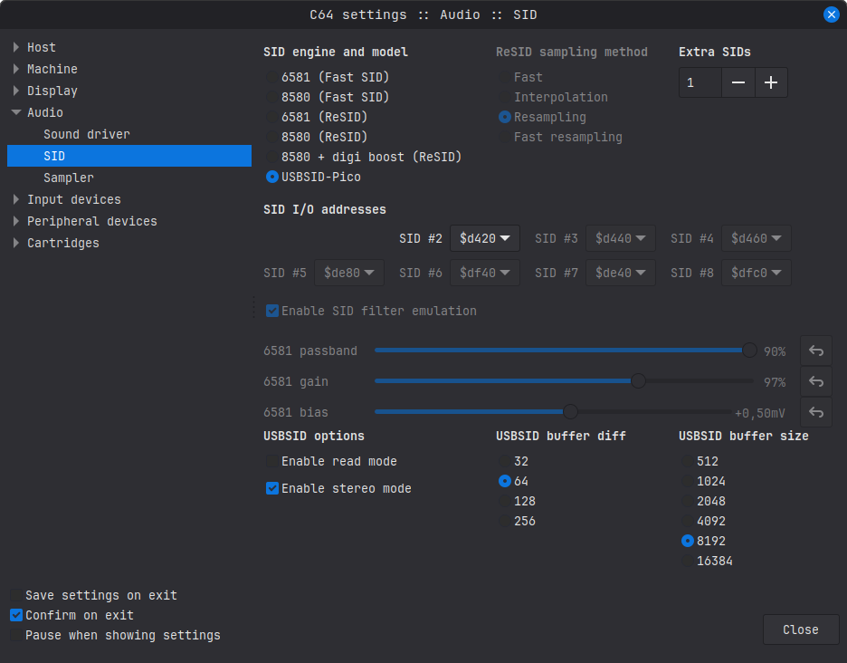

= *USBSID-Pico software manual*
:author: LouD
:description: This document contains consice information for some of the software supporting USBSID-Pico
:url-repo: https://www.github.com/LouDnl/USBSID-Pico
:revdate: {localdate}
:hide-uri-scheme:
:toc:
:toclevels: 4
:toc-placement!:

Author: {author} - generated on {revdate}

toc::[]
[%always]
<<<

== Supported platforms
_In active development_ +
*Linux:* Vice, RetroDebugger, SidBerry, SidplayFp, JSidplay2, USB Midi, ASID & WebUSB (in webbrowser) SID Play +
*Windows:* Vice, SidBerry, USB Midi, ASID & WebUSB (in webbrowser) SID Play +
*Android:* USB Midi, ASID & WebUSB (in webbrowser) SID Play +
*Amiga:* PlaySID library

== Drivers

=== Linux Udev rules
In the https://github.com/LouDnl/USBSID-Pico/blob/master/examples/udev-rules/[examples/udev] directory you can find the https://github.com/LouDnl/USBSID-Pico/blob/master/examples/udev-rules/69-usbsid-permissions.rules[udev rules] that I use on Linux. +
This purely an example file that you can use and change to your own needs.
Steps required for this to work
[source,bash]
----
# Check if you are in the plugdev group with the groups command
groups
# If not, add yourself to the plugdev group, then log out and in
sudo usermod -aG plugdev $USER
# Copy the udev ules file to the correct directory
sudo cp 69-usbsid-permissions.rules /etc/udev/rules.d
# Now reload the udev rules
udevadm control --reload-rules && udevadm trigger
# Not working? Try reloading the service
sudo systemctl restart udev
----

=== Windows driver
Use https://zadig.akeo.ie/[Zadig] to install the correct driver for USBSID-Pico. +
image:images/software/zadig-list-all-devices.png[link="https://github.com/LouDnl/USBSID-Pico/blob/master/doc/images/software/zadig-list-all-devices.png",width="400"]
image:images/software/zadig-install-driver.png[link="https://github.com/LouDnl/USBSID-Pico/blob/master/doc/images/software/zadig-install-driver.png",width="400"] +

=== Test and configure
After setting up your linux udev rules or Windows driver check, configure and test your board on the https://usbsid.loudai.nl/?player=webusb[USBSID] config tool website +

image:images/software/usbsid-config-checkversion.png[link="https://github.com/LouDnl/USBSID-Pico/blob/master/doc/images/software/usbsid-config-checkversion.png",width="400"] +
_For more information on how to configure your board, please refer to the https://github.com/LouDnl/USBSID-Pico/blob/master/doc/USBSID-Pico-firmware-manual.adoc[Firmware manual]_

[%always]
<<<

== Supported software
Each section covers the basic use of USBSID-Pico with the software under that section. For more in depth information please refer to the repective website and or github repo of the software.

=== Deepsid
On the https://deepsid.chordian.net/[deepsid] website you can select `WebUSB (Hermit)` or `ASID (MIDI)` for playing PSID files using a supported browser. +

*WebUSB*: After selecting `WebUSB (Hermit)` you need to click the `CONNECT` button and select USBSID-Pico in the pop-up window. Due to the autoplay feature of Deepsid, you might have to press `STOP` a couple of times before the `CONNECT` button will work.

*ASID*: After selecting `ASID (MIDI)` you need to select USBSID-Pico in the dropdown box next to the line that says `MIDI port for ASID`. It might require refreshing the page a couple of times for the box to be filled with midi devices. +
Supported browsers: +

- *Firefox* supports ASID.
- *Chrome* supports both WebUSB and ASID.
- *Edge* supports both WebUSB and ASID.

[%always]
<<<

=== SidBerry
https://github.com/LouDnl/SidBerry[SidBerry] supports PSID files only and can play SID files on USBSID-Pico via CDC (default) or on ASID supporting players via command line arguments. +
General Linux usage:
[source,bash]
----
# to play sidfile.sid on USBSID-Pico
usbsidberry path/to/sidfile.sid
# to detect and print available midi devices
usbsidberry -midi
# to play sidfile.sid via ASID on USBSID-Pico where `1` is the respective port of the ASID device
usbsidberry -asid 1 path/to/sidfile.sid
----
Basic Windows usage:
[source,powershell]
----
# to play sidfile.sid on USBSID-Pico
usbsidberry.exe path/to/sidfile.sid
# to detect and print available midi devices
usbsidberry.exe -midi
# to play sidfile.sid via ASID on USBSID-Pico where `1` is the respective port of the ASID device
usbsidberry.exe -asid 1 path/to/sidfile.sid
----

[%always]
<<<

=== Vice
This section covers the use of USBSID-Pico with Vice under Linux, Windows and MacOS for the GTK and SDL2 versions of `vsid` and `x64sc`

==== Command-line arguments
Command-line arguments override any previously configured items in your `vicerc` config file. +
All three OS support the same command-line arguments for both `vsid` and `x64sc`. +
However, the sound device argument is OS specific and `vsid` supports a maximum of 3 SID chips +
*Note* that if you define extra SID's and their addresses, these addresses need to point to the required address for the SID tune or Software you want to use. The Vice USBSID-Pico driver will automatically convert each write to the in firmware configured SID chip.
[source,shell]
----
# vsid with usbsid enabled
vsid -sidenginemodel usbsid
# Define extra SID chips and their respective addresses in de Commodore 64 memory space
vsid -sidenginemodel usbsid -sidextra 2 -sid2address 0xD420 -sid3address 0xD440

# vsid with linux Alsa driver and usbsid enabled
vsid -sounddev alsa -sidenginemodel usbsid
----

[%always]
<<<

==== vsid GTK
ALT+O or click Preferences/Settings to open the settings menu. +
*Sound configuration* +
The sound configuration will require tuning for the computer you use it on. +
In the screenshot below you can see that for this system I use the `pulse` audio driver and have the `Buffer size` set to 1 millisecond and `Fragment size` set to very small. +
These 3 settings can make or break the audio quality. +
image:images/software/vsid-soundsettings-linux-gtk.png[link="https://github.com/LouDnl/USBSID-Pico/blob/master/doc/images/software/vsid-soundsettings-linux-gtk.png",width="600"] +
*SID configuration* +
For any audio to come out of the board you _need_ to select USBSID-Pico as SID engine. +
If you want to use more the one SID then you need to select the amount of `Extra SIDs` and set their I/O addresses. +

[%always]
<<<

==== vsid SDL2
F12 to open the settings menu. +
*Sound configuration* +
The sound configuration will require tuning for the computer you use it on. +
In the screenshot below you can see that for this system I use the `pulse` audio driver and have the `Buffer size` set to 10 milliseconds and `Fragment size` set to very small. +
These 3 settings can make or break the audio quality. +
image:images/software/vsid-soundsettings-linux-sdl2.png[link="https://github.com/LouDnl/USBSID-Pico/blob/master/doc/images/software/vsid-soundsettings-linux-sdl2.png",width="600"] +
To get to these settings follow the following settings path: +
`Sound settings` => `Output driver` => Select the driver you want to use +
`Sound settings` => `Buffer size` => Select the milliseconds you want to use +
`Sound settings` => `Fragment size` => Select the size you want to use +
*SID configuration* +
For any audio to come out of the board you _need_ to select USBSID-Pico as SID engine. +
If you want to use more the one SID then you need to select the amount of `Extra SIDs` and set their I/O addresses. +
image:images/software/vsid-sidsettings-linux-sdl2.png[link="https://github.com/LouDnl/USBSID-Pico/blob/master/doc/images/software/vsid-sidsettings-linux-sdl2.png",width="600"]
To get to these settings follow the following settings path: +
`SID settings` => `SID model` => `USBSID-Pico` +
`SID settings` => `Extra SIDs` => select the amount of extra SID's and set their addresses +

[%always]
<<<

==== x64sc GTK
ALT+O or click Preferences/Settings to open the settings menu. +
*Sound configuration* +
The sound configuration will require tuning for the computer you use it on. +
In the screenshot below you can see that for this system I use the `pulse` audio driver and have the `Buffer size` set to 1 millisecond and `Fragment size` set to very small. +
These 3 settings can make or break the audio quality. +
 +
*SID configuration* +
For any audio to come out of the board you _need_ to select USBSID-Pico as SID engine. +
If you want to use more the one SID then you need to select the amount of `Extra SIDs` and set their I/O addresses. +

[%always]
<<<

==== x64sc SDL2
F12 to open the settings menu. +
*Sound configuration* +
The sound configuration will require tuning for the computer you use it on. +
In the screenshot below you can see that for this system I use the `pulse` audio driver and have the `Buffer size` set to 25 milliseconds and `Fragment size` set to very small. +
These 3 settings can make or break the audio quality. +
image:images/software/x64sc-soundsettings-linux-sdl2.png[link="https://github.com/LouDnl/USBSID-Pico/blob/master/doc/images/software/x64sc-soundsettings-linux-sdl2.png",width="600"] +
To get to these settings follow the following settings path: +
`Sound settings` => `Output driver` => Select the driver you want to use +
`Sound settings` => `Buffer size` => Select the milliseconds you want to use +
`Sound settings` => `Fragment size` => Select the size you want to use +
*SID configuration* +
For any audio to come out of the board you _need_ to select USBSID-Pico as SID engine. +
If you want to use more the one SID then you need to select the amount of `Extra SIDs` and set their I/O addresses. +
image:images/software/x64sc-sidsettings-linux-sdl2.png[link="https://github.com/LouDnl/USBSID-Pico/blob/master/doc/images/software/x64sc-sidsettings-linux-sdl2.png",width="600"] +
To get to these settings follow the following settings path: +
`Machine settings` => `Model settings` => `SID settings` => `SID model` => `USBSID-Pico` +
`Machine settings` => `Model settings` => `SID settings` => `Extra SIDs` => select the amount of extra SID's and set their addresses 

[%always]
<<<

=== Retrodebugger
t.b.d.

=== jsidplay2
This section covers the use of USBSID-Pico with `c64jukebox` website that runs on `jsidplay2`

==== c64jukebox
t.b.d.

=== sidplayfp
t.b.d.

== Disclaimer
include::disclaimer.adoc[]

== License
=== Software License ~ GNUv2
include::license-software.adoc[]

=== Hardware License ~ Creative Commons
include::license-hardware.adoc[]

Author: {author} - generated on {revdate}
