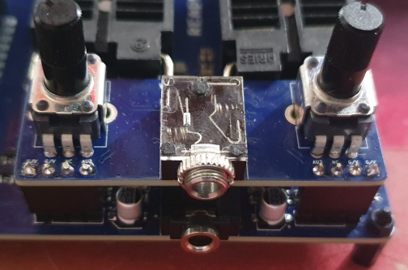
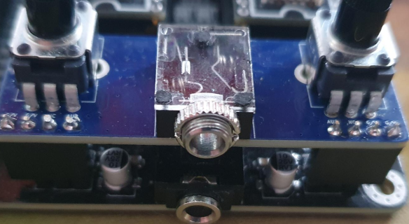
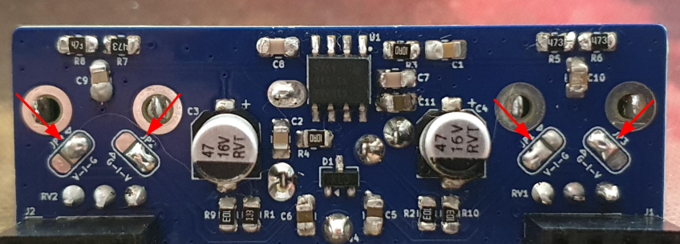
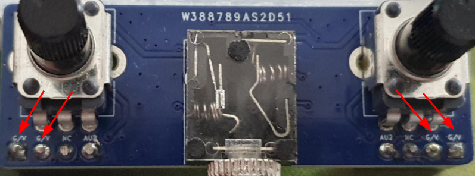
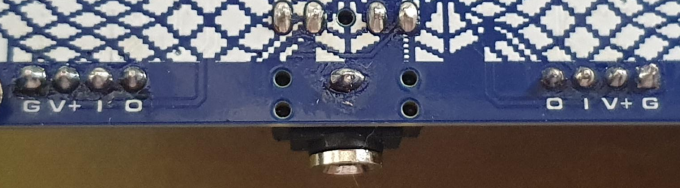
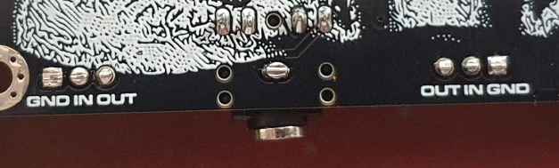
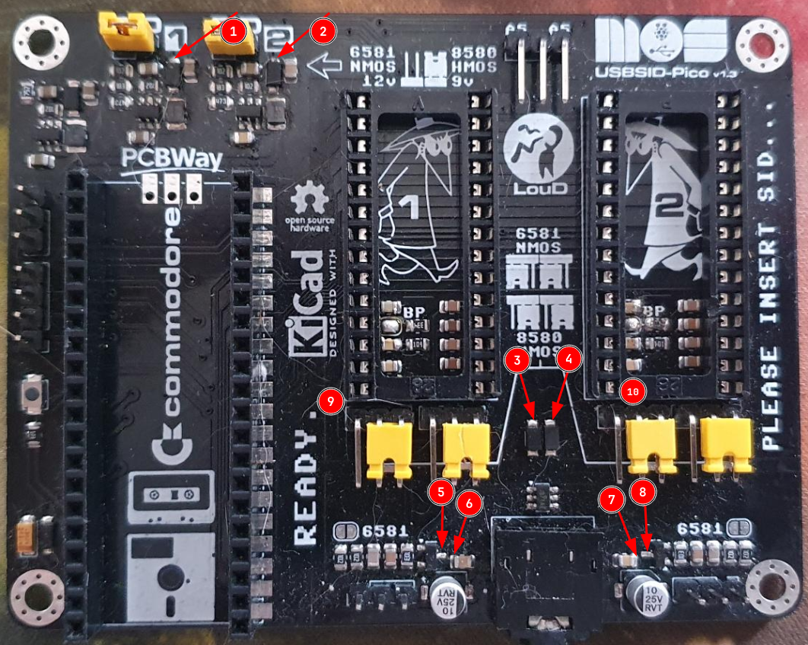

= *USBSID-Volume daughterboard*
:author: LouD
:description: This document contains information about the USBSID-Volume daughterboard and how to use it
:url-repo: https://www.github.com/LouDnl/USBSID-Pico
:revdate: {localdate}
:hide-uri-scheme:
:toc:
:toclevels: 4
:toc-placement!:

Author: {author} - generated on {revdate}

toc::[]
[%always]
<<<

== Disclaimer
include::disclaimer.adoc[]

== About
The volume daughterboard is intended as optional addon for USBSID-Pico. +
With This board seated you can independently control the volume of the left and right audio channels. +
The board is Plug and play compatible with v1.5+ boards. +
Compatibility with v1.3 boards is possible with a small modification to provide voltage.

== Usage v1.5
Below is an example of the board seated. +
Follow the instructions under `Solder jumpers` to configure the board for your pcb. +
 +

== Usage v1.3
Take great care when using the board with versions v1.3. +
Below is an example of the board seated and as you can see the right most pins are unconnected. +
Follow the instructions under `Solder jumpers` and `Voltage tap` to configure the board for your pcb. +
 +

== Usage v1.0
Same as with v1.3, please take great care when using the board. +
The v1.0 pcb only has 2 pins where the outer pin on each side is Ground. This requires you to make another mod to the board to provide ground to the board. Do this at your own risk, the board is _not_ tested with v1.0 pcb's. +

== Solder jumpers
The board has 4 solder jumpers on the bottom that set the pin functions of 2 two outer most pins for each pinsocket. +
These jumpers are marked with `V-I-G` or `G-I-V`, G for Ground, I for Input and V for Vdd. +
 +
 +
For v1.5 boards you can solder the jumpers exactly as the picture above, from left to right:  +
V-*_I-G_*, G-*_I-V_*, *_V-I_*-G, *_G-I_*-V meaning *_Input+Ground_*, *_Input+VDD_*, *_VDD+Input_*, *_Ground+Input_* +
For v1.3 boards you can solder the jumpers as described below, from left to right:  +
*_V-I_*-G, *_G-I_*-V, V-*_I-G_*, G-*_I-V_* meaning *_VDD+Input_*, *_Ground+Input_*, *_Input+Ground_*, *_Input+VDD_* +

The socket pins _must_ match the order of the markings on the bottom of the USBSID-Pico PCB. +
*v1.5:* +
 +
*v1.3:* +
 +
As you can see the v1.3 boards do not have a voltage pin, this requires you to make a voltage tap wire to any of the fixed points described under `Voltage tap`. +

== Voltage tap
*v1.3* pcbs have multiple points to where you can solder a wire to provide voltage to the volume board. +
These tap points are described below the picture. +
 +
*1.* Diode output of SID1 voltage regulator +
*2.* Diode output of SID2 voltage regulator +
*3.* SID1 diode input voltage to audio switch +
*4.* SID2 diode input voltage to audio switch +
*5.* Voltage input to SID1 voltage follower +
*6.* Voltage filter capacitor of SID1 voltage follower +
*7.* Voltage input to SID2 voltage follower +
*8.* Voltage filter capacitor of SID2 voltage follower +
*9.* SID1 VDD in on the bottom of the PCB +
*10.* SID2 VDD in on the bottom of the PCB +

== License
include::license-software.adoc[]

include::license-hardware.adoc[]

Author: {author} - generated on {revdate}
