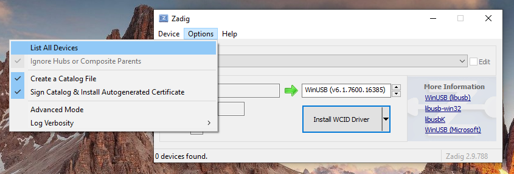
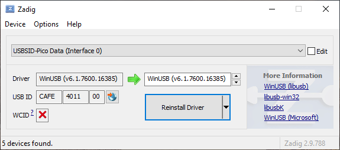

=== Linux Udev rules
In the https://github.com/LouDnl/USBSID-Pico/blob/master/examples/udev-rules/[examples/udev] directory you can find the https://github.com/LouDnl/USBSID-Pico/blob/master/examples/udev-rules/69-usbsid-permissions.rules[udev rules] that I use on Linux. +
This purely an example file that you can use and change to your own needs.
Steps required for this to work
[source,bash]
----
# Check if you are in the plugdev group with the groups command
groups
# If not, add yourself to the plugdev group, then log out and in
sudo usermod -aG plugdev $USER
# Copy the udev ules file to the correct directory
sudo cp 69-usbsid-permissions.rules /etc/udev/rules.d
# Now reload the udev rules
udevadm control --reload-rules && udevadm trigger
# Not working? Try reloading the service
sudo systemctl restart udev
----

=== Windows driver
Use https://zadig.akeo.ie/[Zadig] to install the correct driver. Replace the driver for `USBSID-Pico Data` with WinUSB. +

 +
