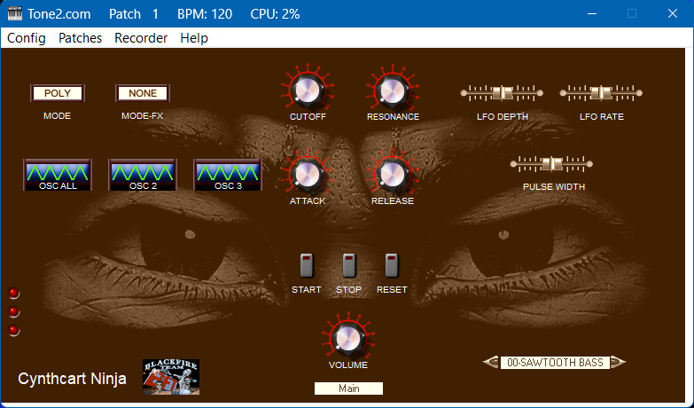
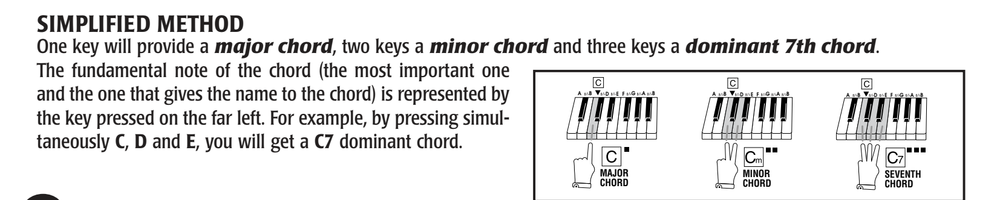
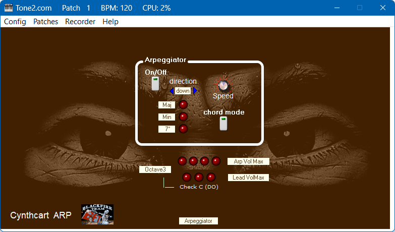
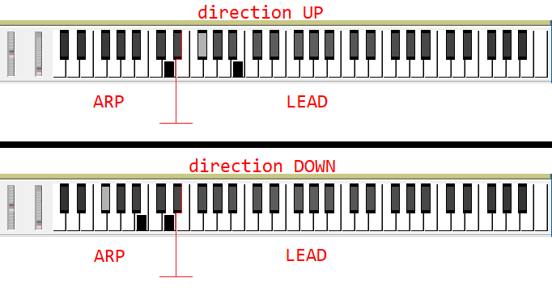

# Cynthcart-Ninja_VST
[Cynthcart-Ninja_VST_for_share.7z](Cynthcart-Ninja_VST_for_share.7z)

Hi,
I'm offering you a Windows-only VST :( for the Cynthcart integrated into USBSid-em that I made in my spare time (I'm renovating my house and have builders, painters, etc. wandering around the house all day with dust everywhere, so I only have late evenings and nights left...)

In this VST, all the standard Cynthcart controls accessible externally work, and it transmits all 30 presets. There's only one problem for now, which doesn't affect its functionality: the stored preset parameters are missing (there are almost 400 parameters to enter. 13 parameters x 30 presets...). When you change presets, the controls don't update. Furthermore, if you save a preset and then reload it, the waveforms don't update on the screen, even though they work normally. I'll have to change the display approach. I also added an arpeggiator (by clicking at the bottom, under the volume, you can select the Arpeggiator panel), which I made from memory. A FARFISA keyboard I owned, and it works in a special way. See the photo in the Farfisa manual.

The arpeggio/chord operation ranges from C to B by only one octave and has four dead semitones (from C to D#) immediately after the octave because they are used to select the chord type XXmaj, XXmin, XX7th. Pressing a diatonic note (white keys) of the relevant octave plays the arpeggio/chord in Major.
Pressing two consecutive diatonic keys plays the arpeggio/chord of the note of the first fret in Minor. Pressing three consecutive diatonic keys plays the arpeggio/chord of the note of the first fret in Seventh. The same thing with the pentatonic keys (black keys). In addition to the arpeggio, you can also set the chord. Unfortunately, only three notes are available on a sid. However, if you set the '6-VOICE SAW' preset in the main panel, you can play the chord with your right hand and have fun soloing with your left hand ;)

In this panel, 'ARPEGGIATOR', there are LEDs that indicate the chord type, and at the bottom there are seven LEDs that are used to identify the operating octave by selecting the octave from the drop-down menu and pressing the C key; when one LED lights up, it indicates the C of the octave affected by the arpeggio/chord. The three chord LEDs are also visible in the 'MAIN' panel on the far left.
It's very nice to use and worth trying. If you use the Cynthcart 2.0.1 with the VICE emulator, the sound is fantastic, especially with the '6-VOICE SAW' preset set to chords and lead. Remember to set the second sid in VICE to $D420 and not $DF00 as indicated ($DF00 is probably needed on a real C64). Unfortunately, the Cynthcart in the USBSid still sounds hoarse with some presets. If you want a cleaner sound with the '6-VOICE SAW' preset, turn the 'Cutoff' knob all the way up: the sound is almost perfect.
This VST can also be used with an external synth or VST, using only the arpeggiator.

The volume drop-down menus are based on the VELOCITY of the key pressed. I left them in for possible future use with SIDs. However, with an external velocity-sensitive VST, they work well.

Part of the arpeggiator add-on module is from jull_ARPHONEZ "Jull (y_riyadi@telkom.net)" and is free.

Raros

A note about Cynthcart Ninja VST. I forgot to add that for those using a smaller MIDI keyboard, it's best to set the "down" parameter in the Arpeggiator panel under the "Direction" menu because the arpeggio invades the lead part of the keyboard. Pictures are better than words. Example of B-min:

